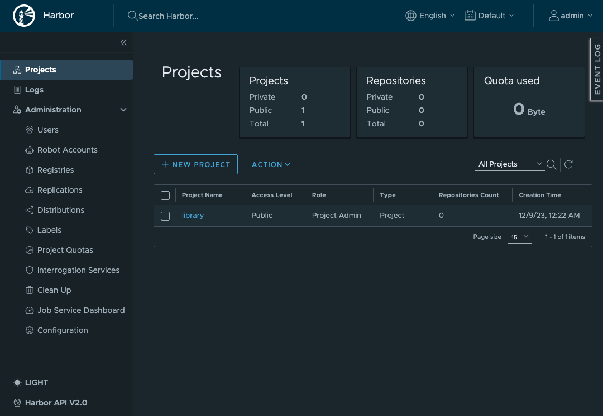
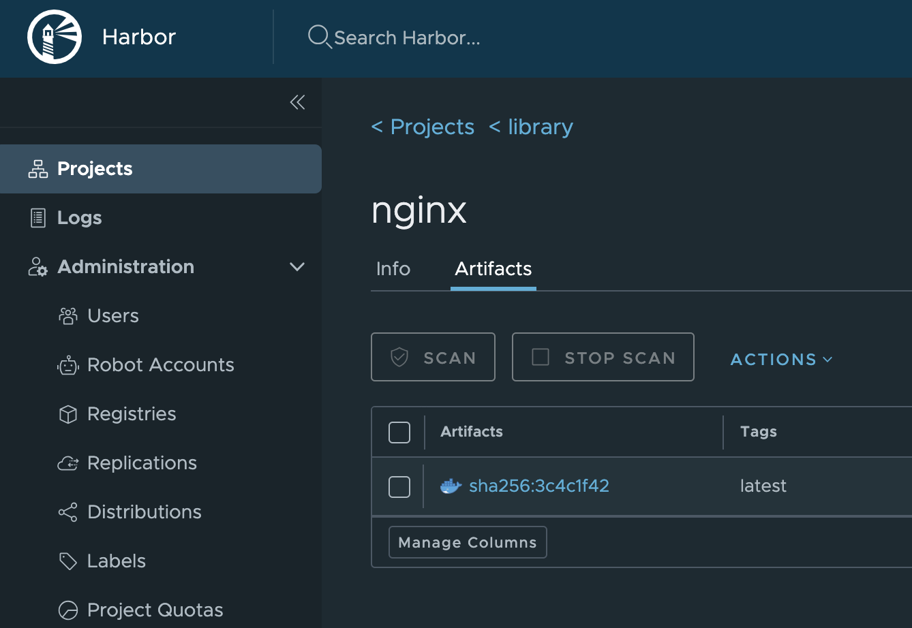

# Harbor on Fedora37 + Proxy

Proxy経由でインターネット疎通できる Fedora37 の上に Harbor を構築する。 \
Proxyサーバは `192.168.13.2:8080` である前提で手順を記載するため、適宜読み替えて実施すること。

CLI の作業は全て `root` ユーザで作業を実施すること。

## Fedora 構築

- 以下の構成で Fedora を 1 台構築する。
  - 仮想マシンスペック
    - CPU: 4 core
    - Mem: 8 GB
    - Disk: 160 GB
  - インストールメディア
    - Fedora-Server-dvd-x86_64-37-1.7.iso

- インストール時に以下を設定する
  - root アカウントを有効化
  - パスワードによるroot SSHログインを許可
  - 
  - 

- コンソールから root ユーザでログインし ホスト名 / IP アドレス / Gateway / DNS を変更する。本手順では以下を前提としてコマンドを記載するため、環境に応じて適宜読み替えて実施すること。

  | ホスト名 | IPアドレス |
  | :---: | :---: |
  | harbor2 | 192.168.14.40 |

> Note \
> 本手順を検証した環境では `harbor` というホスト名のサーバが既に存在しているため本手順で構築する Harbor のホスト名は `harbor2` とするが、
> 特に重複等の理由が無ければホスト名は `harbor` でも問題無い。
  
  ```bash
  # コマンド例
  hostnamectl set-hostname harbor2
  ip a
  nmcli connection modify ens192 ipv4.addresses 192.168.14.40/24
  nmcli connection modify ens192 ipv4.gateway 192.168.14.1
  nmcli connection modify ens192 ipv4.dns 192.168.13.2
  nmcli connection modify ens192 ipv4.method manual
  nmcli connection down ens192
  nmcli connection up ens192
  ip a
  ```

## DNS登録

Harbor の FQDN を決定し、DNS サーバにレコードを登録する。 \
本手順を実施した環境では以下を登録した。適宜読み替えて登録・実行すること。

| 項目 | 値 |
| :--- | :--- |
| FQDN | harbor2.home.ndeguchi.com |
| IP   | 192.168.14.40 |

Harbor を構築する Fedora (上の手順で構築したFedora) から名前解決が出来ることを確認する。

```bash
nslookup harbor2.home.ndeguchi.com
```

```text
<出力例>
Server:         127.0.0.53
Address:        127.0.0.53#53

Non-authoritative answer:
Name:   harbor2.home.ndeguchi.com
Address: 192.168.14.40
```


## dnfリポジトリキャッシュ更新無効化

```bash
systemctl stop dnf-makecache.timer
systemctl disable dnf-makecache.timer
systemctl status dnf-makecache.timer --no-pager
```

## Fedora の Proxy 設定

```bash
cat <<EOF >> /etc/environment
export http_proxy=http://192.168.13.2:8080/
export HTTP_PROXY=http://192.168.13.2:8080/

export https_proxy=http://192.168.13.2:8080/
export HTTPS_PROXY=http://192.168.13.2:8080/

export no_proxy=localhost,127.0.0.1,192.168.14.10,192.168.14.11,192.168.14.12,192.168.14.13,192.168.14.21,192.168.14.22,192.168.14.0/24,10.96.0.0/12,10.20.0.0/16,vip-k8s-master,*.svc,harbor2.home.ndeguchi.com
export NO_PROXY=localhost,127.0.0.1,192.168.14.10,192.168.14.11,192.168.14.12,192.168.14.13,192.168.14.21,192.168.14.22,192.168.14.0/24,10.96.0.0/12,10.20.0.0/16,vip-k8s-master,*.svc,harbor2.home.ndeguchi.com
EOF

source /etc/environment
```

- 192.168.13.2:8080
  - Proxy サーバのIP・ポート番号を指定
- 192.168.14.10
  - Kubernetes の API サーバの IP アドレスを指定
- 192.168.14.11,12,13,21,22
  - ControlPlane#1-3, WorkerNode#1-2 の IP アドレスを指定
- 192.168.14.0/24
  - ControlPlane#1-3, WorkerNode#1-2, Harbor の IP アドレスの NW アドレスを指定
- harbor2.home.ndeguchi.com
  - DNS に登録した Harbor の FQDN

## dnf(yum) のリポジトリ指定

Proxy Server の宛先許可リストを固定するため、dnf のリポジトリ指定を mirror リストから `riken.jp` に変更する。Proxy Server の宛先許可リストを固定する必要が無いのであれば実施不要。

```bash
cd /etc/

# backup
ls -ld yum.repos.d*
  # -> yum.repos.d/ が存在すること

cp -pr yum.repos.d yum.repos.d.bak
ls -ld yum.repos.d*
  # -> yum.repos.d/ と yum.repos.d.bak/ が存在すること

# 変更
cd yum.repos.d
sed -i -e "s/^metalink=/#metalink=/g" ./*
sed -i -e "s,^#baseurl=http://download.example/pub/fedora/linux,baseurl=https://ftp.riken.jp/Linux/fedora,g" ./*
sed -i -e "s/^enabled=1/enabled=0/g" fedora-cisco-openh264.repo

# 差分出力（TerminalLogに記録するだけ。中身を読む必要はない）
diff -u ../yum.repos.d.bak/ .

# 動作確認
dnf check-update
```

実行結果の冒頭に以下と同様の内容が出力され、リポジトリから情報を取得できていることを確認する。

```text
<出力例>
Fedora 37 - x86_64                        32 MB/s |  82 MB     00:02
Fedora Modular 37 - x86_64               7.1 MB/s | 3.8 MB     00:00
Fedora 37 - x86_64 - Updates              18 MB/s |  40 MB     00:02
Fedora Modular 37 - x86_64 - Updates     1.7 MB/s | 2.9 MB     00:01
```

## package update

```bash
dnf update -y
```


## (OPTIONAL) tmux,vim,bash インストール/設定

好みの問題なので実施しなくても問題無し。

```bash
# tmux インストール
dnf install -y tmux

# .tmux.conf
cat <<EOF > ~/.tmux.conf
set -g prefix C-q
unbind C-b
bind h select-pane -L
bind j select-pane -D
bind k select-pane -U
bind l select-pane -R
setw -g mode-keys vi
bind -T copy-mode-vi v send -X begin-selection
bind | split-window -h
bind - split-window -v
bind -r H resize-pane -L 1
bind -r J resize-pane -D 1
bind -r K resize-pane -U 1
bind -r L resize-pane -R 1
EOF

# .vimrc
cat <<EOF > ~/.vimrc
set nocompatible
set number
set tabstop=2
set showmatch
set incsearch
set hlsearch
set nowrapscan
set ignorecase
set fileencodings=utf-8,utf-16le,cp932,iso-2022-jp,euc-jp,default,latin
set foldmethod=marker
set nf=""
nnoremap <ESC><ESC> :nohlsearch<CR>
set laststatus=2
set statusline=%t%m%r%h%w\%=[POS=%p%%/%LLINES]\[TYPE=%Y][FORMAT=%{&ff}]\%{'[ENC='.(&fenc!=''?&fenc:&enc).']'}
syntax enable
set directory=/tmp
set backupdir=/tmp
set undodir=/tmp
set paste
EOF

# .bashrc 追記
cat <<EOF >> ~/.bashrc
alias k=kubectl
set -o vi
EOF
```

## Firewall Stop

```bash
systemctl stop firewalld
systemctl disable firewalld
systemctl status firewalld --no-pager
# "Active: inactive (dead)" であることを確認する
```

## Selinux を無効化

```bash
cat /etc/selinux/config
sed -i 's/^SELINUX=enforcing$/SELINUX=permissive/' /etc/selinux/config
cat /etc/selinux/config
```

## 再起動

```bash
shutdown -r now
```

## 確認

```bash
env | grep -i proxy | sort
```

上記で設定した Proxy の設定が反映されていることを確認

```text
<出力例>
HTTPS_PROXY=http://192.168.13.2:8080/
HTTP_PROXY=http://192.168.13.2:8080/
NO_PROXY=localhost,127.0.0.1,192.168.14.10,192.168.14.11,192.168.14.12,192.168.14.13,192.168.14.21,192.168.14.22,192.168.14.0/24,10.96.0.0/12,10.20.0.0/16,vip-k8s-master,*.svc,harbor2.home.ndeguchi.com
http_proxy=http://192.168.13.2:8080/
https_proxy=http://192.168.13.2:8080/
no_proxy=localhost,127.0.0.1,192.168.14.10,192.168.14.11,192.168.14.12,192.168.14.13,192.168.14.21,192.168.14.22,192.168.14.0/24,10.96.0.0/12,10.20.0.0/16,vip-k8s-master,*.svc,harbor2.home.ndeguchi.com
```

```bash
getenforce
```

以下が出力されることを確認する

```text
<出力例>
Permissive
```

## Docker Engine Install

```bash
# 古いバージョンのDocker パッケージを削除
dnf remove -y docker docker-client docker-client-latest docker-common docker-latest docker-latest-logrotate docker-logrotate docker-selinux docker-engine-selinux docker-engine

# リポジトリを追加
dnf -y install dnf-plugins-core
dnf config-manager --add-repo https://download.docker.com/linux/fedora/docker-ce.repo

# Docker Engine をインストール
dnf install -y docker-ce docker-ce-cli containerd.io docker-buildx-plugin docker-compose-plugin

# Docker Engine を起動
systemctl start docker
systemctl enable docker
systemctl status docker --no-pager
docker run --rm hello-world
```

docker で proxy の設定をまだ行っていないため、失敗することを確認する。

```text
<出力例：以下エラーが出力されることを確認>
Unable to find image 'hello-world:latest' locally
docker: Error response from daemon: Get "https://registry-1.docker.io/v2/": dial tcp 3.216.34.172:443: connect: network is unreachable.
See 'docker run --help'.
```

## Docker の Proxy 設定

```bash
# 設定ファイル作成
mkdir -p /etc/systemd/system/docker.service.d

cat <<EOF > /etc/systemd/system/docker.service.d/http-proxy.conf
[Service]
Environment="HTTP_PROXY=http://192.168.13.2:8080"
Environment="HTTPS_PROXY=http://192.168.13.2:8080"
Environment="NO_PROXY=localhost,127.0.0.1,192.168.14.10,192.168.14.11,192.168.14.12,192.168.14.13,192.168.14.21,192.168.14.22,192.168.14.0/24,10.96.0.0/12,10.20.0.0/16,vip-k8s-master,*.svc,harbor2.home.ndeguchi.com"
EOF
```

- 192.168.13.2:8080
  - Proxy サーバのIP・ポート番号を指定
- 192.168.14.10
  - Kubernetes の API サーバとして指定する IP アドレスを指定
- 192.168.14.11,12,13,21,22
  - ControlPlane#1-3, WorkerNode#1-2 の IP アドレスを指定
- 192.168.14.0/24
  - ControlPlane#1-3, WorkerNode#1-2, Harbor の IP アドレスの NW アドレスを指定
- harbor2.home.ndeguchi.com
  - DNS に登録した Harbor の FQDN

```bash
# 反映
systemctl daemon-reload
systemctl restart docker
systemctl status docker --no-pager

# 設定値確認
systemctl show --property=Environment docker --no-pager
```

```text
<出力例>
Environment=HTTP_PROXY=http://192.168.13.2:8080 HTTPS_PROXY=http://192.168.13.2:8080 "NO_PROXY=localhost,127.0.0.1,192.168.14.10,192.168.14.11,192.168.14.12,192.168.14.13,192.168.14.21,192.168.14.22,192.168.14.0/24,10.96.0.0/12,10.20.0.0/16,vip-k8s-master,*.svc,harbor2.home.ndeguchi.com"
```

```bash
# 動作確認
docker run --rm hello-world
```

docker で proxy の設定を行ったことにより、 proxy 経由で dockerhub (インターネット上) からコンテナイメージを取得出来るようになり正常に実行できることを確認する。
正常に実行できると以下のように `Hello from Docker!` が出力される。

```text
<出力例>
Unable to find image 'hello-world:latest' locally
latest: Pulling from library/hello-world
719385e32844: Pull complete
Digest: sha256:88ec0acaa3ec199d3b7eaf73588f4518c25f9d34f58ce9a0df68429c5af48e8d
Status: Downloaded newer image for hello-world:latest

Hello from Docker!
This message shows that your installation appears to be working correctly.

To generate this message, Docker took the following steps:
 1. The Docker client contacted the Docker daemon.
 2. The Docker daemon pulled the "hello-world" image from the Docker Hub.
    (amd64)
 3. The Docker daemon created a new container from that image which runs the
    executable that produces the output you are currently reading.
 4. The Docker daemon streamed that output to the Docker client, which sent it
    to your terminal.

To try something more ambitious, you can run an Ubuntu container with:
 $ docker run -it ubuntu bash

Share images, automate workflows, and more with a free Docker ID:
 https://hub.docker.com/

For more examples and ideas, visit:
 https://docs.docker.com/get-started/
```

# Docker compose 確認

docker compose を実行可能であることを確認する

```bash
docker compose version
```

以下のようにバージョン情報が出力されることを確認する。

```text
<出力例>
Docker Compose version v2.21.0
```

# openssl 確認

openssl コマンドがインストールされていることを確認する

```bash
openssl version
```

以下のようにバージョン情報が出力されることを確認する。

```text
<出力例>
OpenSSL 3.0.9 30 May 2023 (Library: OpenSSL 3.0.9 30 May 2023)
```

# Download and Unpack the Installer

```bash
cd
wget https://github.com/goharbor/harbor/releases/download/v2.9.1/harbor-offline-installer-v2.9.1.tgz
ls -l harbor-offline-installer-v2.9.1.tgz
tar zxvf harbor-offline-installer-v2.9.1.tgz
ll harbor/
```

# Load Images

```bash
cd ~/harbor/
ll
docker images
docker load < harbor.v2.9.1.tar.gz
# 処理に時間がかかるため数分待機

docker images
```

以下のように Load した image が存在することを確認

```text
<出力例>
REPOSITORY                      TAG       IMAGE ID       CREATED       SIZE
goharbor/harbor-exporter        v2.9.1    37bfd4fa26bc   5 weeks ago   105MB
goharbor/redis-photon           v2.9.1    67827413c0fd   5 weeks ago   209MB
goharbor/trivy-adapter-photon   v2.9.1    a02695b8f8ea   5 weeks ago   469MB
goharbor/harbor-registryctl     v2.9.1    a076218bb631   5 weeks ago   148MB
goharbor/registry-photon        v2.9.1    2f01ea8b1853   5 weeks ago   82.7MB
goharbor/nginx-photon           v2.9.1    5200203dd7ef   5 weeks ago   153MB
goharbor/harbor-log             v2.9.1    ac1cdcc94a5f   5 weeks ago   162MB
goharbor/harbor-jobservice      v2.9.1    d9ff6fc98cc8   5 weeks ago   139MB
goharbor/harbor-core            v2.9.1    0a3a7953409c   5 weeks ago   166MB
goharbor/harbor-portal          v2.9.1    345284db8ca1   5 weeks ago   161MB
goharbor/harbor-db              v2.9.1    69606d285be1   5 weeks ago   358MB
goharbor/prepare                v2.9.1    adb2d804c458   5 weeks ago   253MB
```

# 環境変数設定

以降の作業を効率化するため、 DNS に登録した Harbor の FQDN と IP アドレスを環境変数に設定する。

```bash
cat <<EOF >> ~/.bashrc
export HARBOR_FQDN="harbor2.home.ndeguchi.com"
export HARBOR_IP="192.168.14.40"
EOF
```

- harbor2.home.ndeguchi.com
  - DNS サーバに登録した Harbor の FQDN
- 192.168.14.40
  - DNS サーバに登録した Harbor の IP アドレス

```bash
cat ~/.bashrc
source ~/.bashrc

echo ${HARBOR_FQDN}
  # 上で設定した値が出力されること

echo ${HARBOR_IP}
  # 上で設定した値が出力されること
```

# Generate a Certificate Authority Certificate

```bash
# 1. Generate a CA certificate private key.
cd
openssl genrsa -out ca.key 4096

ll ca.key
  # ファイルが存在することを確認

# 2. Generate the CA certificate.
openssl req -x509 -new -nodes -sha512 -days 3650 \
 -subj "/C=/ST=/L=/O=/OU=/CN=${HARBOR_FQDN}" \
 -key ca.key \
 -out ca.crt
  
  # 以下のログが複数行出力されるが問題無し
  # "req: No value provided for subject name attribute "XXX", skipped"

ll ca.crt
  # ファイルが存在することを確認
```

# Generate a Server Certificate

```bash
# 1. Generate a private key.
openssl genrsa -out ${HARBOR_FQDN}.key 4096

ll ${HARBOR_FQDN}.key
  # ファイルが存在することを確認

# 2. Generate a certificate signing request (CSR).
openssl req -sha512 -new \
    -subj "/C=/ST=/L=/O=/OU=/CN=${HARBOR_FQDN}" \
    -key ${HARBOR_FQDN}.key \
    -out ${HARBOR_FQDN}.csr

  # 以下のログが複数行出力されるが問題無し
  # "req: No value provided for subject name attribute "XXX", skipped"

ll ${HARBOR_FQDN}.csr
  # ファイルが存在することを確認

# 3. Generate an x509 v3 extension file.
cat > v3.ext <<-EOF
authorityKeyIdentifier=keyid,issuer
basicConstraints=CA:FALSE
keyUsage = digitalSignature, nonRepudiation, keyEncipherment, dataEncipherment
extendedKeyUsage = serverAuth
subjectAltName = @alt_names

[alt_names]
DNS.1=${HARBOR_FQDN}
IP.1=${HARBOR_IP}
EOF

cat v3.ext

# 4. Use the v3.ext file to generate a certificate for your Harbor host.
openssl x509 -req -sha512 -days 3650 \
    -extfile v3.ext \
    -CA ca.crt -CAkey ca.key -CAcreateserial \
    -in  ${HARBOR_FQDN}.csr \
    -out ${HARBOR_FQDN}.crt

ll ${HARBOR_FQDN}.crt
  # ファイルが存在することを確認

openssl x509 -text -noout -in ${HARBOR_FQDN}.crt
openssl x509 -text -noout -in ${HARBOR_FQDN}.crt | grep -e "Issuer:" -e "Subject:"
```

Harbor の FQDN が設定されていることを確認

```text
<出力例>
        Issuer: CN = harbor2.home.ndeguchi.com
        Subject: CN = harbor2.home.ndeguchi.com
```

```bash
openssl x509 -text -noout -in ${HARBOR_FQDN}.crt | grep -A 1 "Subject Alternative Name"
```

v3.ext に設定した SAN が設定されていることを確認

```text
<出力例>
            X509v3 Subject Alternative Name:
                DNS:harbor2.home.ndeguchi.com, IP Address:192.168.14.40
```

# CA 証明書を Trust Anchor に登録

```bash
# get list before update
cd
trust list > trust_list_before.txt
ll trust_list_before.txt
cat trust_list_before.txt

# update
cp ca.crt /etc/pki/ca-trust/source/anchors/
update-ca-trust

# get list after update
trust list > trust_list_after.txt
ll trust_list_after.txt
cat trust_list_after.txt

# diff
diff trust_list_before.txt trust_list_after.txt
```

Harbor の CA 証明書が差分として出力されること

```text
<出力例>
> pkcs11:id=%2C%A4%D7%54%77%D8%EF%0E%DE%35%DE%4A%29%2D%C1%02%52%05%41%BA;type=cert
>     type: certificate
>     label: harbor2.home.ndeguchi.com
>     trust: anchor
>     category: authority
>
```

# Provide the Certificates to Harbor and Docker

```bash
# 1. Copy the server certificate and key into the certficates folder on your Harbor host.
mkdir -p /data/cert/
cp ${HARBOR_FQDN}.crt /data/cert/
cp ${HARBOR_FQDN}.key /data/cert/
ll /data/cert/

# 2. Convert yourdomain.com.crt to yourdomain.com.cert, for use by Docker.
openssl x509 -inform PEM -in ${HARBOR_FQDN}.crt -out ${HARBOR_FQDN}.cert
ll ${HARBOR_FQDN}.cert
  # ファイルが存在することを確認

# 3. Copy the server certificate, key and CA files into the Docker certificates folder on the Harbor host.
#    You must create the appropriate folders first.
mkdir -p /etc/docker/certs.d/${HARBOR_FQDN}/
cp ${HARBOR_FQDN}.cert /etc/docker/certs.d/${HARBOR_FQDN}/
cp ${HARBOR_FQDN}.key  /etc/docker/certs.d/${HARBOR_FQDN}/
cp ca.crt /etc/docker/certs.d/${HARBOR_FQDN}/
ll /etc/docker/certs.d/${HARBOR_FQDN}/
```

ca.crt, cert, key 以下3ファイルが存在することを確認

```text
<出力例>
-rw-r--r--. 1 root root 1850 12月  9 16:25 ca.crt
-rw-r--r--. 1 root root 1952 12月  9 16:25 harbor2.home.ndeguchi.com.cert
-rw-------. 1 root root 3268 12月  9 16:25 harbor2.home.ndeguchi.com.key
```

```bash
# 4. Restart Docker Engine.
systemctl restart docker
systemctl status docker -l --no-pager
```

# Configure the Harbor YML File

```bash
cd ~/harbor/

# backup
cp -p harbor.yml.tmpl harbor.yml
ll harbor.yml*

# admin ユーザのパスワード と DB のパスワードに設定したい文字列を環境変数に設定
export HARBOR_PW="VMware1!"

# update
sed -i -e "s/^hostname:.*$/hostname: ${HARBOR_FQDN}/g" harbor.yml
sed -i -e "s,^  certificate: .*$,  certificate: /data/cert/${HARBOR_FQDN}.crt,g" harbor.yml
sed -i -e "s,^  private_key: .*$,  private_key: /data/cert/${HARBOR_FQDN}.key,g" harbor.yml
sed -i -e "s/^harbor_admin_password: .*$/harbor_admin_password: ${HARBOR_PW}/g" harbor.yml
sed -i -e "s/^  password: .*$/  password: ${HARBOR_PW}/g" harbor.yml

# 差分確認
diff -u harbor.yml.tmpl harbor.yml
```

以下値をが正しく設定されていることを確認する。

- hostname
  - harbor の FQDN
- https.certificate
  - /data/cert/ 配下に配置した crt ファイルのフルパス
- https.private_key
  - /data/cert/ 配下に配置した key ファイルのフルパス
- harbor_admin_password
  - admin ユーザのパスワード
- database.password
  - DB のパスワード

```diff
<設定例>
-hostname: reg.mydomain.com
+hostname: harbor2.home.ndeguchi.com

 http:
-  certificate: /your/certificate/path
-  private_key: /your/private/key/path
+  certificate: /data/cert/harbor2.home.ndeguchi.com.crt
+  private_key: /data/cert/harbor2.home.ndeguchi.com.key

-harbor_admin_password: Harbor12345
+harbor_admin_password: VMware1!

 database:
   # The password for the root user of Harbor DB. Change this before any production use.
-  password: root123
+  password: VMware1!
```

# Deploy or Reconfigure Harbor

```bash
# Run the prepare script to enable HTTPS.
cd ~/harbor
./prepare
```

```text
<出力例>
prepare base dir is set to /root/harbor
Clearing the configuration file: /config/portal/nginx.conf
Clearing the configuration file: /config/log/logrotate.conf
Clearing the configuration file: /config/log/rsyslog_docker.conf
Clearing the configuration file: /config/nginx/nginx.conf
Clearing the configuration file: /config/core/env
Clearing the configuration file: /config/core/app.conf
Clearing the configuration file: /config/registry/passwd
Clearing the configuration file: /config/registry/config.yml
Clearing the configuration file: /config/registryctl/env
Clearing the configuration file: /config/registryctl/config.yml
Clearing the configuration file: /config/db/env
Clearing the configuration file: /config/jobservice/env
Clearing the configuration file: /config/jobservice/config.yml
Generated configuration file: /config/portal/nginx.conf
Generated configuration file: /config/log/logrotate.conf
Generated configuration file: /config/log/rsyslog_docker.conf
Generated configuration file: /config/nginx/nginx.conf
Generated configuration file: /config/core/env
Generated configuration file: /config/core/app.conf
Generated configuration file: /config/registry/config.yml
Generated configuration file: /config/registryctl/env
Generated configuration file: /config/registryctl/config.yml
Generated configuration file: /config/db/env
Generated configuration file: /config/jobservice/env
Generated configuration file: /config/jobservice/config.yml
loaded secret from file: /data/secret/keys/secretkey
Generated configuration file: /compose_location/docker-compose.yml
Clean up the input dir
```

```bash
ll docker-compose.yml
cat docker-compose.yml

# Start Harbor
docker compose up -d
watch docker ps
```

全てのコンテナの STATUS が UP かつ healthy になるまで待機する。

```text
<出力例>
CONTAINER ID   IMAGE                                COMMAND                   CREATED          STATUS                    PORTS                                                                            NAMES
be2dcdea2eb3   goharbor/harbor-jobservice:v2.9.1    "/harbor/entrypoint.…"   52 seconds ago   Up 30 seconds (healthy)                                                                                    harbor-jobservice
acbc2faf41fa   goharbor/nginx-photon:v2.9.1         "nginx -g 'daemon of…"   52 seconds ago   Up 47 seconds (healthy)   0.0.0.0:80->8080/tcp, :::80->8080/tcp, 0.0.0.0:443->8443/tcp, :::443->8443/tcp   nginx
df6590a09088   goharbor/harbor-core:v2.9.1          "/harbor/entrypoint.…"   52 seconds ago   Up 48 seconds (healthy)                                                                                    harbor-core
e7fe07503149   goharbor/harbor-portal:v2.9.1        "nginx -g 'daemon of…"   52 seconds ago   Up 50 seconds (healthy)                                                                                    harbor-portal
4d66f439d965   goharbor/harbor-registryctl:v2.9.1   "/home/harbor/start.…"   52 seconds ago   Up 49 seconds (healthy)                                                                                    registryctl
a6d7e368288a   goharbor/registry-photon:v2.9.1      "/home/harbor/entryp…"   52 seconds ago   Up 50 seconds (healthy)                                                                                    registry
9de4031f3949   goharbor/harbor-db:v2.9.1            "/docker-entrypoint.…"   52 seconds ago   Up 50 seconds (healthy)                                                                                    harbor-db
c1e9a3ae15ae   goharbor/redis-photon:v2.9.1         "redis-server /etc/r…"   52 seconds ago   Up 50 seconds (healthy)                                                                                    redis
88c0286d6024   goharbor/harbor-log:v2.9.1           "/bin/sh -c /usr/loc…"   53 seconds ago   Up 51 seconds (healthy)   127.0.0.1:1514->10514/tcp                                                        harbor-log
```

# localhost の Docker からアクセス確認

Harbor を構築した Fedora の Docker から Harbor にアクセスできることを確認する

```bash
# Login
docker login ${HARBOR_FQDN} --username admin
```

パスワード入力後、Login Succeeded が出力されることを確認する

```text
<出力例>
Password:
WARNING! Your password will be stored unencrypted in /root/.docker/config.json.
Configure a credential helper to remove this warning. See
https://docs.docker.com/engine/reference/commandline/login/#credentials-store

Login Succeeded
```

dockerhub から nginx を取得し、これを Harbor へ push できることを確認する

```bash
docker pull nginx:latest
docker images
docker images | grep "nginx.*latest"
docker tag nginx:latest ${HARBOR_FQDN}/library/nginx:latest
docker images | grep "nginx.*latest"
docker push ${HARBOR_FQDN}/library/nginx:latest
```

以下のように push に成功することを確認する

```text
The push refers to repository [harbor2.home.ndeguchi.com/library/nginx]
0d0e9c83b6f7: Pushed
cddc309885a2: Pushed
c2d3ab485d1b: Pushed
66283570f41b: Pushed
f5525891d9e9: Pushed
8ae474e0cc8f: Pushed
92770f546e06: Pushed
latest: digest: sha256:3c4c1f42a89e343c7b050c5e5d6f670a0e0b82e70e0e7d023f10092a04bbb5a7 size: 1778
```

# 他のサーバへの証明書配置・Proxy設定・動作確認

作業対象サーバ：Kubernetes の ControlPlane, WorkerNode, 管理クライアントなど、Harbor にアクセスする全てのサーバで以下作業を実施する。

```bash
# Harbor の FQDN を環境変数に設定
cat <<EOF >> ~/.bashrc
export HARBOR_FQDN="harbor2.home.ndeguchi.com"
EOF
```

- harbor2.home.ndeguchi.com
  - Harbor の FQDN

```bash
source ~/.bashrc
echo ${HARBOR_FQDN}
  # -> Harbor の FQDN が出力されること

nslookup ${HARBOR_FQDN}
  # -> Harbor の FQDN を名前解決できること（IPを引けること）

# Docker の http-proxy.conf を backup
cp -p /etc/systemd/system/docker.service.d/http-proxy.conf /etc/systemd/system/docker.service.d/http-proxy.conf.bak
ll /etc/systemd/system/docker.service.d/http-proxy.conf*

# Docker の http-proxy.conf を 修正
sed -i -e "s/^Environment=\"NO_PROXY=\(.*\)\"/Environment=\"NO_PROXY=\1,${HARBOR_FQDN}\"/g" /etc/systemd/system/docker.service.d/http-proxy.conf

# 差分確認
diff -u /etc/systemd/system/docker.service.d/http-proxy.conf.bak /etc/systemd/system/docker.service.d/http-proxy.conf
```

以下が差分として出力され、 `NO_PROXY` の末尾に Harbor の FQDN が追加されていること。

```diff
-Environment="NO_PROXY=localhost,(...省略...),vip-k8s-master,*.svc"
+Environment="NO_PROXY=localhost,(...省略...),vip-k8s-master,*.svc,harbor2.home.ndeguchi.com"
```

```bash
# Docker 再起動
systemctl daemon-reload
systemctl restart docker
systemctl status docker --no-pager

# 設定値確認
systemctl show --property=Environment docker --no-pager
```

NO_PROXY の末尾に Harbor の FQDN が追記されていること。

```text
<出力例>
Environment=(省略)"NO_PROXY=(省略),*.svc,harbor2.home.ndeguchi.com"
                                        ^^^^^^^^^^^^^^^^^^^^^^^^^^
```

```bash
# Harbor の CA 証明書を取得
mkdir -p /etc/docker/certs.d/${HARBOR_FQDN}
cd /etc/docker/certs.d/${HARBOR_FQDN}
scp root@${HARBOR_FQDN}:/root/ca.crt .
ll

# Harbor にログインできることを確認
docker login ${HARBOR_FQDN} --username admin
```

パスワード入力後、Login Succeeded が出力されることを確認する

```text
<出力例>
Password:
WARNING! Your password will be stored unencrypted in /root/.docker/config.json.
Configure a credential helper to remove this warning. See
https://docs.docker.com/engine/reference/commandline/login/#credentials-store

Login Succeeded
```

```bash
# Harbor から image を pull できることを確認する。
docker pull ${HARBOR_FQDN}/library/nginx:latest
```

```text
<出力例>
latest: Pulling from library/nginx
1f7ce2fa46ab: Pull complete
9b16c94bb686: Pull complete
9a59d19f9c5b: Pull complete
9ea27b074f71: Pull complete
c6edf33e2524: Pull complete
84b1ff10387b: Pull complete
517357831967: Pull complete
Digest: sha256:3c4c1f42a89e343c7b050c5e5d6f670a0e0b82e70e0e7d023f10092a04bbb5a7
Status: Downloaded newer image for harbor2.home.ndeguchi.com/library/nginx:latest
harbor2.home.ndeguchi.com/library/nginx:latest
```

```bash
# pull したイメージが存在することを確認する
docker images | grep "nginx.*latest"
```

```text
<出力例>
harbor2.home.ndeguchi.com/library/nginx   latest     a6bd71f48f68   2 weeks ago     187MB
```

```bash
# pull したイメージを削除する
docker rmi ${HARBOR_FQDN}/library/nginx:latest
docker images | grep "nginx.*latest"
  # -> イメージが存在しないこと(何も出力されないこと)を確認する
```


# 管理コンソールで Harbor の CA 証明書を Trust Anchor に登録

作業対象サーバ：管理クライアント

```bash
# get list before update
cd
trust list > trust_list_before.txt
ll trust_list_before.txt
cat trust_list_before.txt

# copy CA cert
cp /etc/docker/certs.d/${HARBOR_FQDN}/ca.crt /etc/pki/ca-trust/source/anchors/
ll /etc/pki/ca-trust/source/anchors/
update-ca-trust

# get list after update
trust list > trust_list_after.txt
ll trust_list_after.txt
cat trust_list_after.txt

# diff
diff trust_list_before.txt trust_list_after.txt
```

Harbor の CA 証明書が差分として出力されること

```text
<出力例>
> pkcs11:id=%2C%A4%D7%54%77%D8%EF%0E%DE%35%DE%4A%29%2D%C1%02%52%05%41%BA;type=cert
>     type: certificate
>     label: harbor2.home.ndeguchi.com
>     trust: anchor
>     category: authority
>
```

```bash
# reboot
shutdown -r now
```

# 管理コンソールからブラウザアクセスできることを確認

作業対象サーバ：管理クライアント

- GUI でログインして Firefox の Proxy 設定を開き `プロキシーなしで接続` に Harbor の FQDN を追加する。
  - 
- Firefox で Harbor の FQDN にアクセスしログインできることを確認する。
  - ID: `admin`, PW: harbor.ymlで指定したパスワード
  - 
  - 
- library/nginx:latest が存在することを確認する
  - 


# Kubernetes での動作確認

作業対象サーバ：管理クライアント

```bash
# Harbor で保持する nginx を実行
kubectl run nginx --image=${HARBOR_FQDN}/library/nginx:latest
  # -> "pod/nginx created" が出力されること

watch kubectl get pod nginx
```

`STATUS` が `Running` になるまで待機

```text
<実行例>
NAME    READY   STATUS    RESTARTS   AGE
nginx   1/1     Running   0          74s
```

```bash
kubectl get pod nginx -o yaml | grep ${HARBOR_FQDN}
```

image の値が `<HarborのFQDN>/library/nginx:latest` であることを確認する。

```text
  - image: harbor2.home.ndeguchi.com/library/nginx:latest
```

```bash
# Pod 削除
kubectl delete pod nginx
  # -> "pod "nginx" deleted" が出力されること

kubectl get pod nginx
  # pods "nginx" not found が出力されること
```

