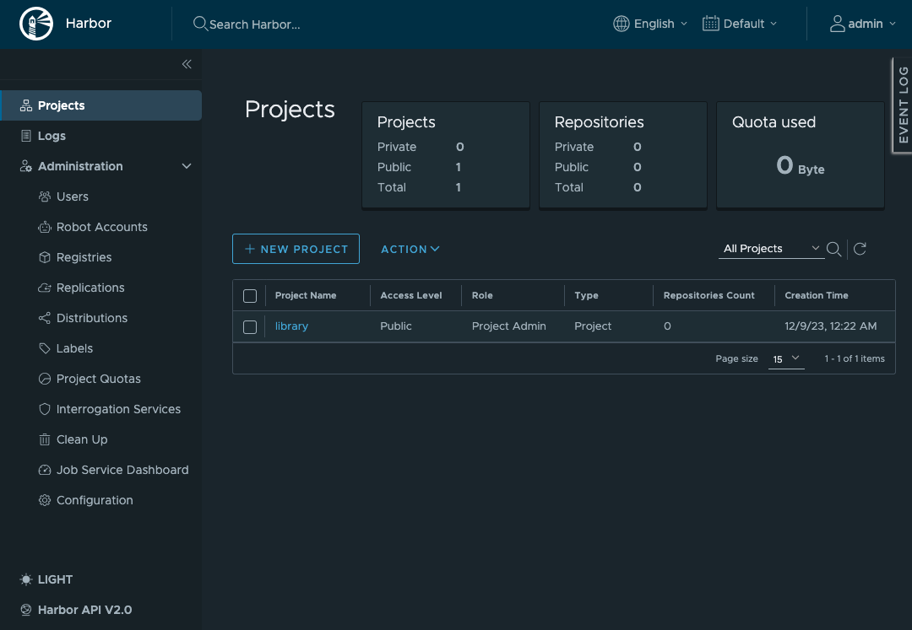
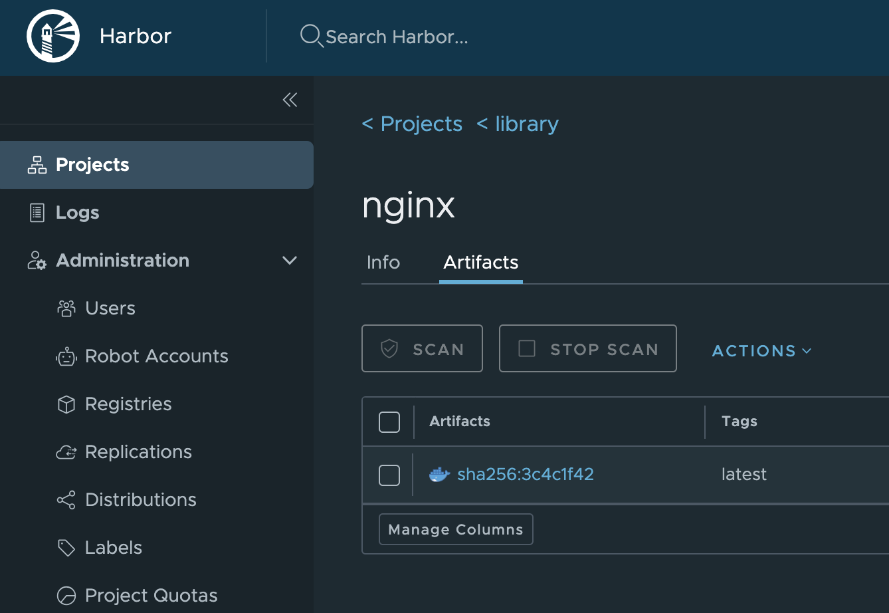

# Harbor 構築

CLI の作業は全て `root` ユーザで作業を実施すること。

## Fedora 構築

- 以下の構成で Fedora を 1 台構築する。
  - 仮想マシンスペック
    - CPU: 4 core
    - Mem: 8 GB
    - Disk: 160 GB
  - インストールメディア
    - Fedora-Server-dvd-x86_64-37-1.7.iso

- インストール時に以下を設定する
  - root アカウントを有効化
  - パスワードによるroot SSHログインを許可
  - 
  - 

## 共通設定作業

- [共通設定作業](50-common.md) を実施する。

# Docker compose 確認

- docker compose を実行可能であることを確認する

  ```bash
  docker compose version
  ```

  - 以下のようにバージョン情報が出力されることを確認する。

    ```text
    <出力例>
    Docker Compose version v2.21.0
    ```

# openssl 確認

- openssl コマンドがインストールされていることを確認する

  ```bash
  openssl version
  ```

  - 以下のようにバージョン情報が出力されることを確認する。

    ```text
    <出力例>
    OpenSSL 3.0.9 30 May 2023 (Library: OpenSSL 3.0.9 30 May 2023)
    ```

# Download and Unpack the Installer

- Harbor の offline installer をダウンロードし解凍する

  ```bash
  cd
  wget https://github.com/goharbor/harbor/releases/download/v2.9.1/harbor-offline-installer-v2.9.1.tgz
  ls -l harbor-offline-installer-v2.9.1.tgz
  tar zxvf harbor-offline-installer-v2.9.1.tgz
  ll harbor/
  ```

# Load Images

- Harbor のコンテナイメージをロードする

  ```bash
  cd ~/harbor/
  ll
  docker images
  docker load < harbor.v2.9.1.tar.gz
  # 処理に時間がかかるため数分待機
  
  docker images
  ```

  - 以下のように Load した image が存在することを確認

    ```text
    <出力例>
    REPOSITORY                      TAG       IMAGE ID       CREATED       SIZE
    goharbor/harbor-exporter        v2.9.1    37bfd4fa26bc   5 weeks ago   105MB
    goharbor/redis-photon           v2.9.1    67827413c0fd   5 weeks ago   209MB
    goharbor/trivy-adapter-photon   v2.9.1    a02695b8f8ea   5 weeks ago   469MB
    goharbor/harbor-registryctl     v2.9.1    a076218bb631   5 weeks ago   148MB
    goharbor/registry-photon        v2.9.1    2f01ea8b1853   5 weeks ago   82.7MB
    goharbor/nginx-photon           v2.9.1    5200203dd7ef   5 weeks ago   153MB
    goharbor/harbor-log             v2.9.1    ac1cdcc94a5f   5 weeks ago   162MB
    goharbor/harbor-jobservice      v2.9.1    d9ff6fc98cc8   5 weeks ago   139MB
    goharbor/harbor-core            v2.9.1    0a3a7953409c   5 weeks ago   166MB
    goharbor/harbor-portal          v2.9.1    345284db8ca1   5 weeks ago   161MB
    goharbor/harbor-db              v2.9.1    69606d285be1   5 weeks ago   358MB
    goharbor/prepare                v2.9.1    adb2d804c458   5 weeks ago   253MB
    ```

# Generate a Certificate Authority Certificate

- Harbor の SSL 証明書を作成するため、まずは CA 証明書を作成する。

  ```bash
  # 1. Generate a CA certificate private key.
  cd
  openssl genrsa -out ca.key 4096
  
  ll ca.key
    # -> ファイルが存在することを確認
  
  # 2. Generate the CA certificate.
  openssl req -x509 -new -nodes -sha512 -days 3650 \
   -subj "/C=/ST=/L=/O=/OU=/CN=${harbor_fqdn}" \
   -key ca.key \
   -out ca.crt
    
    # -> 以下のログが複数行出力されるが問題無し
    #    "req: No value provided for subject name attribute "XXX", skipped"
  
  ll ca.crt
    # -> ファイルが存在することを確認
  ```

# Generate a Server Certificate

- Harbor の SSL 証明書を作成する

  ```bash
  # 1. Generate a private key.
  openssl genrsa -out ${harbor_fqdn}.key 4096
  
  ll ${harbor_fqdn}.key
    # -> ファイルが存在することを確認
  
  # 2. Generate a certificate signing request (CSR).
  openssl req -sha512 -new \
      -subj "/C=/ST=/L=/O=/OU=/CN=${harbor_fqdn}" \
      -key ${harbor_fqdn}.key \
      -out ${harbor_fqdn}.csr
  
    # -> 以下のログが複数行出力されるが問題無し
    #    "req: No value provided for subject name attribute "XXX", skipped"
  
  ll ${harbor_fqdn}.csr
    # -> ファイルが存在することを確認
  
  # 3. Generate an x509 v3 extension file.
  cat > v3.ext <<-EOF
  authorityKeyIdentifier=keyid,issuer
  basicConstraints=CA:FALSE
  keyUsage = digitalSignature, nonRepudiation, keyEncipherment, dataEncipherment
  extendedKeyUsage = serverAuth
  subjectAltName = @alt_names
  
  [alt_names]
  DNS.1=${harbor_fqdn}
  IP.1=${harbor_ip}
  EOF
  
  cat v3.ext
  
  # 4. Use the v3.ext file to generate a certificate for your Harbor host.
  openssl x509 -req -sha512 -days 3650 \
      -extfile v3.ext \
      -CA ca.crt -CAkey ca.key -CAcreateserial \
      -in  ${harbor_fqdn}.csr \
      -out ${harbor_fqdn}.crt
  
  ll ${harbor_fqdn}.crt
    # -> ファイルが存在することを確認
  
  openssl x509 -text -noout -in ${harbor_fqdn}.crt
  openssl x509 -text -noout -in ${harbor_fqdn}.crt | grep -e "Issuer:" -e "Subject:"
  ```

  - Harbor の FQDN が設定されていることを確認

    ```text
    <出力例>
            Issuer: CN = harbor2.home.ndeguchi.com
            Subject: CN = harbor2.home.ndeguchi.com
    ```

  ```bash
  openssl x509 -text -noout -in ${harbor_fqdn}.crt | grep -A 1 "Subject Alternative Name"
  ```

  - v3.ext に設定した SAN が証明書に設定されていることを確認

    ```text
    <出力例>
    X509v3 Subject Alternative Name:
        DNS:harbor2.home.ndeguchi.com, IP Address:192.168.14.40
    ```

# CA 証明書を Trust Anchor に登録

- Harbor の CA 証明書をサーバの Trust Anchor に登録する。

  ```bash
  # get list before update
  cd
  trust list > trust_list_before.txt
  ll trust_list_before.txt
  cat trust_list_before.txt
  
  # update
  cp ca.crt /etc/pki/ca-trust/source/anchors/
  update-ca-trust
  
  # get list after update
  trust list > trust_list_after.txt
  ll trust_list_after.txt
  cat trust_list_after.txt
  
  # diff
  diff trust_list_before.txt trust_list_after.txt
  ```

  - Harbor の CA 証明書が差分として出力されること

    ```text
    <出力例>
    > pkcs11:id=%2C%A4%D7%54%77%D8%EF%0E%DE%35%DE%4A%29%2D%C1%02%52%05%41%BA;type=cert
    >     type: certificate
    >     label: harbor2.home.ndeguchi.com
    >     trust: anchor
    >     category: authority
    >
    ```

# Provide the Certificates to Harbor and Docker

- Harbor が上記で作成した SSL 証明書を用いて起動するよう設定

  ```bash
  # 1. Copy the server certificate and key into the certficates folder on your Harbor host.
  mkdir -p /data/cert/
  cp ${harbor_fqdn}.crt /data/cert/
  cp ${harbor_fqdn}.key /data/cert/
  ll /data/cert/
  
  # 2. Convert yourdomain.com.crt to yourdomain.com.cert, for use by Docker.
  openssl x509 -inform PEM -in ${harbor_fqdn}.crt -out ${harbor_fqdn}.cert
  ll ${harbor_fqdn}.cert
    # -> ファイルが存在することを確認
  
  # 3. Copy the server certificate, key and CA files into the Docker certificates folder on the Harbor host.
  #    You must create the appropriate folders first.
  mkdir -p /etc/docker/certs.d/${harbor_fqdn}/
  cp ${harbor_fqdn}.cert /etc/docker/certs.d/${harbor_fqdn}/
  cp ${harbor_fqdn}.key  /etc/docker/certs.d/${harbor_fqdn}/
  cp ca.crt /etc/docker/certs.d/${harbor_fqdn}/
  ll /etc/docker/certs.d/${harbor_fqdn}/
  ```

  - ca.crt, cert, key 以下3ファイルが存在することを確認

    ```text
    <出力例>
    -rw-r--r--. 1 root root 1850 12月  9 16:25 ca.crt
    -rw-r--r--. 1 root root 1952 12月  9 16:25 harbor2.home.ndeguchi.com.cert
    -rw-------. 1 root root 3268 12月  9 16:25 harbor2.home.ndeguchi.com.key
    ```

  ```bash
  # 4. Restart Docker Engine.
  systemctl restart docker
  systemctl status docker -l --no-pager
  ```

# Configure the Harbor YML File

- harbor を起動する際に指定する設定ファイルを修正する

  ```bash
  cd ~/harbor/
  
  # backup
  cp -p harbor.yml.tmpl harbor.yml
  ll harbor.yml*
  
  # admin ユーザのパスワード と DB のパスワードに設定したい文字列を環境変数に設定
  export HARBOR_PW="VMware1!"
  
  # update
  sed -i -e "s/^hostname:.*$/hostname: ${harbor_fqdn}/g" harbor.yml
  sed -i -e "s,^  certificate: .*$,  certificate: /data/cert/${harbor_fqdn}.crt,g" harbor.yml
  sed -i -e "s,^  private_key: .*$,  private_key: /data/cert/${harbor_fqdn}.key,g" harbor.yml
  sed -i -e "s/^harbor_admin_password: .*$/harbor_admin_password: ${HARBOR_PW}/g" harbor.yml
  sed -i -e "s/^  password: .*$/  password: ${HARBOR_PW}/g" harbor.yml
  
  # 差分確認
  diff -u harbor.yml.tmpl harbor.yml
  ```

  - 以下値をが正しく設定されていることを確認する。
    - hostname
      - harbor の FQDN
    - https.certificate
      - /data/cert/ 配下に配置した crt ファイルのフルパス
    - https.private_key
      - /data/cert/ 配下に配置した key ファイルのフルパス
    - harbor_admin_password
      - admin ユーザのパスワード
    - database.password
      - DB のパスワード

    ```diff
    <設定例>
    -hostname: reg.mydomain.com
    +hostname: harbor2.home.ndeguchi.com
    
     http:
    -  certificate: /your/certificate/path
    -  private_key: /your/private/key/path
    +  certificate: /data/cert/harbor2.home.ndeguchi.com.crt
    +  private_key: /data/cert/harbor2.home.ndeguchi.com.key
    
    -harbor_admin_password: Harbor12345
    +harbor_admin_password: VMware1!
    
     database:
       # The password for the root user of Harbor DB. Change this before any production use.
    -  password: root123
    +  password: VMware1!
    ```

# Deploy or Reconfigure Harbor

- Harbor を起動

  ```bash
  # Run the prepare script to enable HTTPS.
  cd ~/harbor
  ./prepare
  ```

  - 以下のように `Generated configuration file: /compose_location/docker-compose.yml` が出力されることを確認

    ```text
    <出力例>
    prepare base dir is set to /root/harbor
    Clearing the configuration file: /config/portal/nginx.conf
    Clearing the configuration file: /config/log/logrotate.conf
    Clearing the configuration file: /config/log/rsyslog_docker.conf
    Clearing the configuration file: /config/nginx/nginx.conf
    Clearing the configuration file: /config/core/env
    Clearing the configuration file: /config/core/app.conf
    Clearing the configuration file: /config/registry/passwd
    Clearing the configuration file: /config/registry/config.yml
    Clearing the configuration file: /config/registryctl/env
    Clearing the configuration file: /config/registryctl/config.yml
    Clearing the configuration file: /config/db/env
    Clearing the configuration file: /config/jobservice/env
    Clearing the configuration file: /config/jobservice/config.yml
    Generated configuration file: /config/portal/nginx.conf
    Generated configuration file: /config/log/logrotate.conf
    Generated configuration file: /config/log/rsyslog_docker.conf
    Generated configuration file: /config/nginx/nginx.conf
    Generated configuration file: /config/core/env
    Generated configuration file: /config/core/app.conf
    Generated configuration file: /config/registry/config.yml
    Generated configuration file: /config/registryctl/env
    Generated configuration file: /config/registryctl/config.yml
    Generated configuration file: /config/db/env
    Generated configuration file: /config/jobservice/env
    Generated configuration file: /config/jobservice/config.yml
    loaded secret from file: /data/secret/keys/secretkey
    Generated configuration file: /compose_location/docker-compose.yml
    Clean up the input dir
    ```

  ```bash
  ll docker-compose.yml
  cat docker-compose.yml
  
  # Start Harbor
  docker compose up -d
  watch docker ps
  ```

  - 全てのコンテナの STATUS が UP かつ healthy になるまで待機する。

    ```text
    <出力例>
    CONTAINER ID   IMAGE                                COMMAND                   CREATED          STATUS                    PORTS                                                                            NAMES
    be2dcdea2eb3   goharbor/harbor-jobservice:v2.9.1    "/harbor/entrypoint.…"   52 seconds ago   Up 30 seconds (healthy)                                                                                    harbor-jobservice
    acbc2faf41fa   goharbor/nginx-photon:v2.9.1         "nginx -g 'daemon of…"   52 seconds ago   Up 47 seconds (healthy)   0.0.0.0:80->8080/tcp, :::80->8080/tcp, 0.0.0.0:443->8443/tcp, :::443->8443/tcp   nginx
    df6590a09088   goharbor/harbor-core:v2.9.1          "/harbor/entrypoint.…"   52 seconds ago   Up 48 seconds (healthy)                                                                                    harbor-core
    e7fe07503149   goharbor/harbor-portal:v2.9.1        "nginx -g 'daemon of…"   52 seconds ago   Up 50 seconds (healthy)                                                                                    harbor-portal
    4d66f439d965   goharbor/harbor-registryctl:v2.9.1   "/home/harbor/start.…"   52 seconds ago   Up 49 seconds (healthy)                                                                                    registryctl
    a6d7e368288a   goharbor/registry-photon:v2.9.1      "/home/harbor/entryp…"   52 seconds ago   Up 50 seconds (healthy)                                                                                    registry
    9de4031f3949   goharbor/harbor-db:v2.9.1            "/docker-entrypoint.…"   52 seconds ago   Up 50 seconds (healthy)                                                                                    harbor-db
    c1e9a3ae15ae   goharbor/redis-photon:v2.9.1         "redis-server /etc/r…"   52 seconds ago   Up 50 seconds (healthy)                                                                                    redis
    88c0286d6024   goharbor/harbor-log:v2.9.1           "/bin/sh -c /usr/loc…"   53 seconds ago   Up 51 seconds (healthy)   127.0.0.1:1514->10514/tcp                                                        harbor-log
    ```

# localhost の Docker から Login できることを確認

- Harbor を構築した Fedora の Docker から Harbor にアクセスできることを確認する

  ```bash
  # Login
  docker login ${harbor_fqdn} --username admin
  ```

  - パスワード入力後、Login Succeeded が出力されることを確認する

    ```text
    <出力例>
    Password:
    WARNING! Your password will be stored unencrypted in /root/.docker/config.json.
    Configure a credential helper to remove this warning. See
    https://docs.docker.com/engine/reference/commandline/login/#credentials-store
    
    Login Succeeded
    ```

# nginx コンテナイメージ取得

- Docker Hub に疎通できるサーバで nginx のコンテナイメージを取得する。 \
  **注意** : Harbor を構築している Fedora ではなく Docker Hub に疎通できる別サーバで実施すること。

  ```bash
  docker images
  docker pull nginx:latest
  ```

  - 取得に成功すること

    ```text
    <出力例>
    latest: Pulling from library/nginx
    af107e978371: Pull complete
    336ba1f05c3e: Pull complete
    8c37d2ff6efa: Pull complete
    51d6357098de: Pull complete
    782f1ecce57d: Pull complete
    5e99d351b073: Pull complete
    7b73345df136: Pull complete
    Digest: sha256:2bdc49f2f8ae8d8dc50ed00f2ee56d00385c6f8bc8a8b320d0a294d9e3b49026
    Status: Downloaded newer image for nginx:latest
    docker.io/library/nginx:latest
    ```

  ```bash
  docker images | grep -e REPOSITORY -e nginx
  ```

  - nginx が存在すること

    ```text
    REPOSITORY   TAG      IMAGE ID       CREATED        SIZE
    nginx        latest   d453dd892d93   2 months ago   187MB
    ```

  ```bash
  docker save nginx:latest > nginx-latest.tar
  ll nginx-latest.tar
  gzip nginx-latest.tar
  ll nginx-latest.tar.gz
  ```

- 上記で圧縮したファイル `nginx-latest.tar.gz` を Harbor を構築している Fedora の `/root/` に配置する。

- `nginx-latest.tar.gz` を Harbor を構築している Fedora の Docker にロードする。 \
  **注意** Harbor サーバ上で実施すること。

  ```bash
  cd ~/
  ls -l nginx-latest.tar.gz
    # -> ファイルが存在すること
  
  docker load < nginx-latest.tar.gz
  ```

  - ロードに成功すること

    ```text
    7292cf786aa8: Loading layer [==============>]  77.82MB/77.82MB
    370869eba6e9: Loading layer [==============>]    113MB/113MB
    2a13e6a7cca6: Loading layer [==============>]  3.584kB/3.584kB
    01aaa195cdad: Loading layer [==============>]  4.608kB/4.608kB
    f6ba584ca3ec: Loading layer [==============>]   2.56kB/2.56kB
    e50c68532c4a: Loading layer [==============>]   5.12kB/5.12kB
    b074db3b55e1: Loading layer [==============>]  7.168kB/7.168kB
    Loaded image: nginx:latest
    ```

  ```bash
  docker images | grep -e REPOSITORY -e nginx.*latest
  ```

  - nginx:latest のコンテナイメージが存在すること

    ```text
    REPOSITORY  TAG       IMAGE ID       CREATED        SIZE
    nginx       latest    d453dd892d93   2 months ago   187MB
    ```

# localhost の Docker から Push できることを確認

- Harbor を構築した Fedora の Docker から Harbor にコンテナイメージを Push できることを確認する

  ```bash
  docker tag nginx:latest ${harbor_fqdn}/library/nginx:latest
  docker images | grep -e REPOSITORY -e nginx.*latest
  ```

  - \<harbor_fqdn\>/library/nginx:latest が存在すること

    ```text
    <出力例>
    REPOSITORY                                TAG       IMAGE ID       CREATED        SIZE
    nginx                                     latest    d453dd892d93   2 months ago   187MB
    harbor2.home.ndeguchi.com/library/nginx   latest    d453dd892d93   2 months ago   187MB
    ```

  ```bash
  docker push ${harbor_fqdn}/library/nginx:latest
  ```

  - push に成功すること

    ```text
    The push refers to repository [harbor2.home.ndeguchi.com/library/nginx]
    b074db3b55e1: Pushed
    e50c68532c4a: Pushed
    f6ba584ca3ec: Pushed
    01aaa195cdad: Pushed
    2a13e6a7cca6: Pushed
    370869eba6e9: Pushed
    7292cf786aa8: Pushed
    latest: digest: sha256:4669f6671aca20a34c3dfcd017e84fb3cae40788ea664866eaea698e3dfe241c size: 1778
    ```

# 自動起動設定

- サーバ起動時に Harbor が自動起動するよう設定する

  ```bash
  cat <<EOF > /etc/rc.local
  #!/usr/bin/bash
  cd /root/harbor
  docker compose up -d
  EOF
  
  chmod 755 /etc/rc.local
  ll /etc/rc.local
  
  /etc/rc.local
  
  cat <<EOF > /etc/systemd/system/rc-local.service
  [Unit]
  Description=/etc/rc.local
  
  [Service]
  ExecStart=/etc/rc.local
  Restart=no
  Type=simple
  
  [Install]
  WantedBy=multi-user.target
  EOF
  
  systemctl enable rc-local.service
  ```

- 再起動
  
  ```bash
  shutdown -r now
  ```

- 再起動後、Harborが起動することを確認する

  ```bash
  docker ps | grep harbor | wc -l
  docker ps
  ```
  - 以下9個の Harbor のコンテナが存在し、全てが `Up` かつ `healthy` であること

    ```text
    <出力例>
    CONTAINER ID   IMAGE                                COMMAND                   CREATED          STATUS                        PORTS                                                                            NAMES
    a4539b6437ec   goharbor/harbor-jobservice:v2.9.1    "/harbor/entrypoint.…"   18 minutes ago   Up 56 seconds (healthy)                                                                                        harbor-jobservice
    0e3f59a0efe2   goharbor/nginx-photon:v2.9.1         "nginx -g 'daemon of…"   18 minutes ago   Up About a minute (healthy)   0.0.0.0:80->8080/tcp, :::80->8080/tcp, 0.0.0.0:443->8443/tcp, :::443->8443/tcp   nginx
    d0f2f33e445a   goharbor/harbor-core:v2.9.1          "/harbor/entrypoint.…"   18 minutes ago   Up About a minute (healthy)                                                                                    harbor-core
    d4b58b1f8f77   goharbor/redis-photon:v2.9.1         "redis-server /etc/r…"   18 minutes ago   Up About a minute (healthy)                                                                                    redis
    2f8051939aea   goharbor/registry-photon:v2.9.1      "/home/harbor/entryp…"   18 minutes ago   Up About a minute (healthy)                                                                                    registry
    5926aa4ee847   goharbor/harbor-db:v2.9.1            "/docker-entrypoint.…"   18 minutes ago   Up About a minute (healthy)                                                                                    harbor-db
    a36086a6d834   goharbor/harbor-registryctl:v2.9.1   "/home/harbor/start.…"   18 minutes ago   Up About a minute (healthy)                                                                                    registryctl
    5654ef2e9293   goharbor/harbor-portal:v2.9.1        "nginx -g 'daemon of…"   18 minutes ago   Up About a minute (healthy)                                                                                    harbor-portal
    b43ff5244909   goharbor/harbor-log:v2.9.1           "/bin/sh -c /usr/loc…"   18 minutes ago   Up About a minute (healthy)   127.0.0.1:1514->10514/tcp                                                        harbor-log
    ```


# 管理クライアントへの証明書配置・動作確認

作業対象サーバ：管理クライアント **(注意)**

- docker から Harbor に接続し利用できることを確認する

  ```bash
  # Harbor の CA 証明書を取得
  mkdir -p /etc/docker/certs.d/${harbor_fqdn}
  cd /etc/docker/certs.d/${harbor_fqdn}
  scp root@${harbor_fqdn}:/root/ca.crt .
  ll
  
  # Harbor にログインできることを確認
  docker login ${harbor_fqdn} --username admin
  ```

  - パスワード入力後、Login Succeeded が出力されることを確認する

    ```text
    <出力例>
    Password:
    WARNING! Your password will be stored unencrypted in /root/.docker/config.json.
    Configure a credential helper to remove this warning. See
    https://docs.docker.com/engine/reference/commandline/login/#credentials-store
    
    Login Succeeded
    ```

  ```bash
  # Harbor から nginx を pull
  docker pull ${harbor_fqdn}/library/nginx:latest
  ```

  - Harbor から image を pull できること

    ```text
    <出力例>
    latest: Pulling from library/nginx
    1f7ce2fa46ab: Pull complete
    9b16c94bb686: Pull complete
    9a59d19f9c5b: Pull complete
    9ea27b074f71: Pull complete
    c6edf33e2524: Pull complete
    84b1ff10387b: Pull complete
    517357831967: Pull complete
    Digest: sha256:3c4c1f42a89e343c7b050c5e5d6f670a0e0b82e70e0e7d023f10092a04bbb5a7
    Status: Downloaded newer image for harbor2.home.ndeguchi.com/library/nginx:latest
    harbor2.home.ndeguchi.com/library/nginx:latest
    ```

  ```bash
  docker images | grep "nginx.*latest"
  ```

  - pull したイメージが存在することを確認する

    ```text
    <出力例>
    harbor2.home.ndeguchi.com/library/nginx   latest     a6bd71f48f68   2 weeks ago     187MB
    ```

  ```bash
  # pull したイメージを削除する
  docker rmi ${harbor_fqdn}/library/nginx:latest
  docker images | grep "nginx.*latest"
  ```

  - イメージが存在しないこと(何も出力されないこと)を確認する

- Harbor の CA 証明書を Trust Anchor に登録

  ```bash
  # get list before update
  cd
  trust list > trust_list_before.txt
  ll trust_list_before.txt
  cat trust_list_before.txt
  
  # copy CA cert
  cp /etc/docker/certs.d/${harbor_fqdn}/ca.crt /etc/pki/ca-trust/source/anchors/
  ll /etc/pki/ca-trust/source/anchors/
  update-ca-trust
  
  # get list after update
  trust list > trust_list_after.txt
  ll trust_list_after.txt
  cat trust_list_after.txt
  
  # diff
  diff trust_list_before.txt trust_list_after.txt
  ```

  - Harbor の CA 証明書が差分として出力されること

    ```text
    <出力例>
    > pkcs11:id=%2C%A4%D7%54%77%D8%EF%0E%DE%35%DE%4A%29%2D%C1%02%52%05%41%BA;type=cert
    >     type: certificate
    >     label: harbor2.home.ndeguchi.com
    >     trust: anchor
    >     category: authority
    >
    ```

  ```bash
  # 再起動
  shutdown -r now
  ```

- ブラウザアクセス確認
  - GUI でログインし Firefox で Harbor の FQDN にアクセス・ログインできることを確認する。
    - ID: `admin`, PW: harbor.ymlで指定したパスワード
    - 
    - 
  - library/nginx:latest が存在することを確認する
    - 


