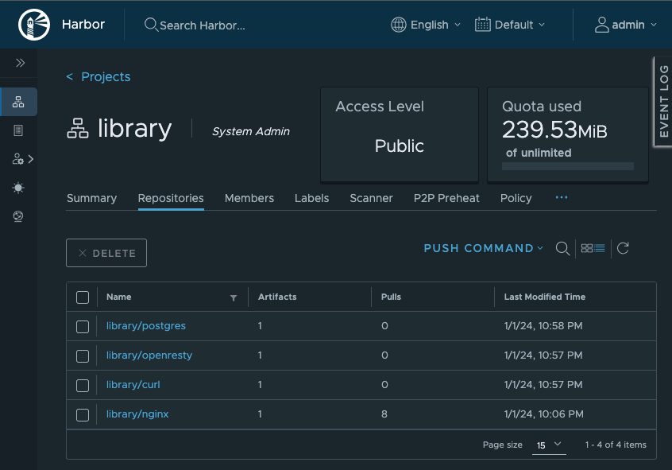
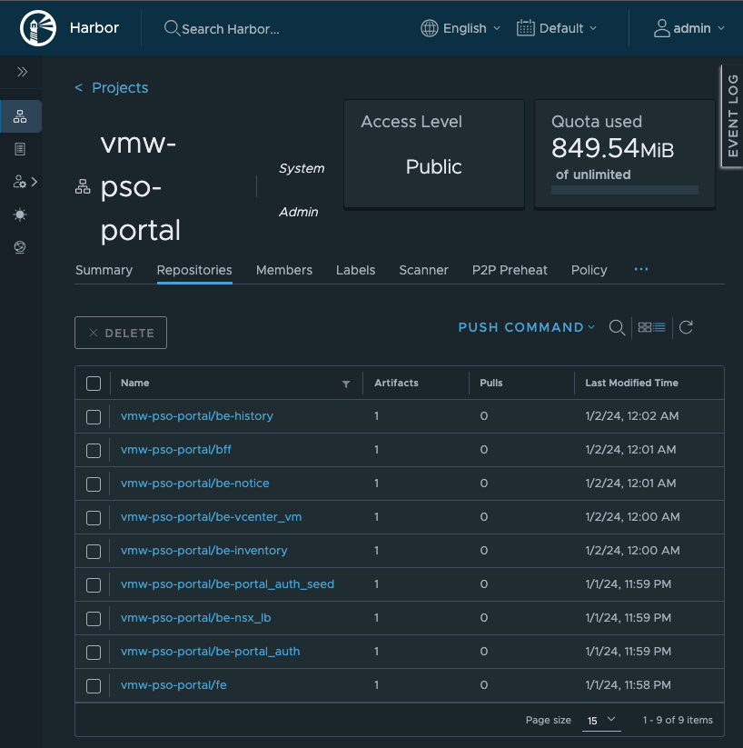

# PSO Portal Deploy

## Harbor のサーバ上に NFS サーバを構築

- Portal の PostgreSQL のデータを Kubernetes 外部で保持するため、 Harbor を構築している Fedora 上に NFS サーバを構築する。 \
  他の NFS サービスを利用する方針でも問題無いが、 権限 `rw,no_root_squash` を付与すること。 \
  作業実施サーバ: Harbor **(注意)**

  ```bash
  cat <<EOF > /etc/exports
  /nfsshare 192.168.0.0/16(rw,no_root_squash)
  EOF
  ```

  - 192.168.0.0/16
    - NFS サーバを公開するネットワークアドレス

  ```bash
  cat /etc/exports
  
  mkdir -p /nfsshare/vmw-pso-portal-postgres
  
  systemctl status rpcbind nfs-server
  systemctl enable --now rpcbind nfs-server
  systemctl status rpcbind nfs-server
  ```

  - rpcbind, nfs-server が `active` であること

    ```text
    <出力例>
    ● rpcbind.service - RPC Bind
         Loaded: loaded (/usr/lib/systemd/system/rpcbind.service; enabled; preset: disabled)
         Active: active (running) since Mon 2024-01-01 22:35:55 JST; 2s ago
    TriggeredBy: ● rpcbind.socket
           Docs: man:rpcbind(8)
       Main PID: 19881 (rpcbind)
          Tasks: 1 (limit: 9463)
         Memory: 1.7M
            CPU: 17ms
         CGroup: /system.slice/rpcbind.service
                 └─19881 /usr/bin/rpcbind -w -f
    
     1月 01 22:35:55 harbor2 systemd[1]: Starting rpcbind.service - RPC Bind...
     1月 01 22:35:55 harbor2 systemd[1]: Started rpcbind.service - RPC Bind.
    
    ● nfs-server.service - NFS server and services
         Loaded: loaded (/usr/lib/systemd/system/nfs-server.service; enabled; preset: disabled)
        Drop-In: /run/systemd/generator/nfs-server.service.d
                 └─order-with-mounts.conf
         Active: active (exited) since Mon 2024-01-01 22:35:56 JST; 1s ago
        Process: 19892 ExecStartPre=/usr/sbin/exportfs -r (code=exited, status=0/SUCCESS)
        Process: 19893 ExecStart=/usr/sbin/rpc.nfsd (code=exited, status=0/SUCCESS)
        Process: 19913 ExecStart=/bin/sh -c if systemctl -q is-active gssproxy; then systemctl reload gssproxy ; fi (code=exited, status=0/SUCCESS)
       Main PID: 19913 (code=exited, status=0/SUCCESS)
            CPU: 20ms
    
     1月 01 22:35:55 harbor2 systemd[1]: Starting nfs-server.service - NFS server and services...
     1月 01 22:35:56 harbor2 systemd[1]: Finished nfs-server.service - NFS server and services.
    ```

## dockerhub から Container Image を取得し Harbor へpush

- インターネットからコンテナイメージを取得できるサーバで PostgreSQL/OpenResty/Curl のコンテナイメージを取得する。 \
  本手順で構築している Fedora ではなくインターネットからコンテナイメージを取得出来る別サーバで実施すること。 **(注意)**

  ```bash
  mkdir common-images
  cd common-images

  # pull
  docker pull postgres:13.10
  docker pull openresty/openresty:latest
  docker pull curlimages/curl:latest
  
  # list
  docker images postgres:13.10
  docker images openresty/openresty:latest
  docker images curlimages/curl:latest

  # save
  docker save postgres:13.10             > postgres_13.10.tar
  docker save openresty/openresty:latest > openresty_latest.tar
  docker save curlimages/curl:latest     > curl_latest.tar

  # gzip
  gzip postgres_13.10.tar
  gzip openresty_latest.tar
  gzip curl_latest.tar
  
  # list
  ls -l
  ```

  - gzip で圧縮したファイルが存在すること

    ```text
    -rw-r--r--  1 ndeguchi  staff    7052771  1  1 22:50 curl_latest.tar.gz
    -rw-r--r--  1 ndeguchi  staff   35445000  1  1 22:50 openresty_latest.tar.gz
    -rw-r--r--  1 ndeguchi  staff  132858307  1  1 22:50 postgres_13.10.tar.gz
    ```

  ```bash
  cd ../
  ls -ld common-images/
  ```

  - ディレクトリ `common-images` が存在すること

  ```bash
  tar -zcvf common-images.tar.gz common-images
  ls -l common-images.tar.gz
    # -> ファイルが存在すること
  ```

- 上記で作成したファイル `common-images.tar.gz` を管理クライアントの `/root/` 配下に転送したうえで以下作業を実施する。 \
  管理クライアントにて作業を実施すること。 **(注意)**

  ```bash
  cd ~/
  ls -l common-images.tar.gz
  ```

  - ファイル `common-images.tar.gz` が存在すること

  ```bash
  tar -zxvf common-images.tar.gz
  ls -lR common-images
  cd common-images
  ls -l
  ```

  - コンテナイメージの gz ファイルが存在すること

    ```text
    -rw-r--r--. 1 502 games   7052771  1月  1 22:50 curl_latest.tar.gz
    -rw-r--r--. 1 502 games  35445000  1月  1 22:50 openresty_latest.tar.gz
    -rw-r--r--. 1 502 games 132858307  1月  1 22:50 postgres_13.10.tar.gz
    ```

  ```bash
  docker images
  
  for f in $(ls); do
    echo "===== ${f} ====="
    docker load < ${f}
    echo ""
  done
  
  docker images | grep -e curl -e openresty -e postgres
  ```

  - 以下イメージが存在すること

    ```text
    curlimages/curl       latest   94fbf6205e5f   3 weeks ago    16.8MB
    openresty/openresty   latest   14a754b99891   5 weeks ago    93.2MB
    postgres              13.10    c562f2f06bc5   8 months ago   374MB
    ```

  ```bash
  # tag
  docker tag curlimages/curl:latest     ${harbor_fqdn}/library/curl:latest
  docker tag openresty/openresty:latest ${harbor_fqdn}/library/openresty:latest
  docker tag postgres:13.10             ${harbor_fqdn}/library/postgres:13.10

  docker images | grep -e curl -e openresty -e postgres | sort
  
  # push
  docker push ${harbor_fqdn}/library/curl:latest
  docker push ${harbor_fqdn}/library/openresty:latest
  docker push ${harbor_fqdn}/library/postgres:13.10
  ```

  - GUI で Harbor を開き、 library プロジェクトに cur, openresty, postgres のコンテナイメージが存在することを確認する
    


## Harbor でプロジェクト作成

作業実施サーバ: 管理クライアント

- 管理クライアントに GUI でログイン
- Firefox を起動し Harbor にアクセス
- Harbor で新規プロジェクトを作成
  - Project Name
    - vmw-pso-portal
  - Access Level
    - Public にチェック
  - Project quota limits
    - -1
  - Proxy Cache
    - Off

## PSO-Portal の Image を Harbor へ push

- 管理クライアント **(注意)** の GUI から Firefox を開き以下作業を実施する。
  - Harbor にログイン
  - `NEW PROJECT` ボタンから新規プロジェクトを作成

    | 項目                 | 値                |
    | :---:                | :---:             |
    | Project Name         | vmw-pso-portal    |
    | Access Level         | Public にチェック |
    | Project quota limits | -1 GiB            |
    | Proxy Cache          | off               |

    

- PSO Portal コンテナイメージを配置するためのディレクトリ作成
  作業対象サーバ：管理クライアント

  ```bash
  mkdir ~/vmw-pso-portal-images/
  ```

- PSO Portal コンテナイメージのファイルを上記で作成したディレクトリに配置する

- PSO Portal コンテナイメージを Harbor に Push する。

  ```bash
  cd ~/vmw-pso-portal-images/
  ls -l
  ```

  - デプロイ対象のコンテナイメージが存在すること

    ```test
    -rw-r--r--. 1 root root 149985838  1月  1 23:28 vmw-pso-portal-be-history.tar.gz
    -rw-r--r--. 1 root root 150446171  1月  1 23:29 vmw-pso-portal-be-inventory.tar.gz
    -rw-r--r--. 1 root root 148143321  1月  1 23:29 vmw-pso-portal-be-notice.tar.gz
    -rw-r--r--. 1 root root 146626845  1月  1 23:30 vmw-pso-portal-be-nsx_lb.tar.gz
    -rw-r--r--. 1 root root 154592812  1月  1 23:31 vmw-pso-portal-be-portal_auth.tar.gz
    -rw-r--r--. 1 root root 154596443  1月  1 23:31 vmw-pso-portal-be-portal_auth_seed.tar.gz
    -rw-r--r--. 1 root root 118387079  1月  1 23:32 vmw-pso-portal-be-vcenter_vm.tar.gz
    -rw-r--r--. 1 root root 141536162  1月  1 23:32 vmw-pso-portal-bff.tar.gz
    ```

  ```bash
  images=("be-history" "be-inventory" "be-notice" "be-nsx_lb" "be-portal_auth" "be-portal_auth_seed" "be-vcenter_vm" "bff" "fe")

  # docker 上に古いイメージが存在する場合は削除
  for label in ${images[@]}; do
    for image in $(docker images | grep ${label} | awk '{ print $1":"$2 }'); do
      echo "===== ${image} ====="
      docker rmi ${image}
      echo ""
    done
  done

  # load
  for f in $(ls *.gz); do
    echo "===== ${f} ====="
    docker load < ${f}
    echo ""
  done
  
  # tag
  for label in ${images[@]}; do
    echo "===== ${label} ====="
    src_image=$(docker images | grep "${label} " | awk '{ print $1":"$2 }')
    echo "- src_image = ${src_image}"
    dst_image="${harbor_fqdn}/vmw-pso-portal/${label}:latest"
    echo "- dst_image = ${dst_image}"
    docker tag ${src_image} ${dst_image}
    docker images ${dst_image}
    echo ""
  done
  
  # push
  for image in $(docker images | grep ${harbor_fqdn}/vmw-pso-portal  | awk '{ print $1":"$2 }'); do
    echo "===== ${image} ====="
    docker push ${image}
    echo ""
  done
  ```

- Harbor に push したイメージが存在することを確認する
  

## Manifest ファイルを取得

- PSO Portal の Manifest ファイルを配置するためのディレクトリ作成
  作業対象サーバ：管理クライアント

  ```bash
  mkdir ~/vmw-pso-portal-manifests/
  ```

- PSO Portal の Manifest ファイルを上記で作成したディレクトリに配置する

- PSO Portal の Manifest ファイルを修正する

  ```bash
  cd ~/
  ls -lR cloud-hub-manifests/
  ```

  - manifests ファイルが存在すること

    ```text
    <出力例>
    cloud-hub-manifests/:
    合計 60
    -rw-r--r--. 1 502 games 2155 12月 24 18:32 be-console-openresty.yaml
    -rw-r--r--. 1 502 games 1757 12月 24 18:32 be-history.yaml
    -rw-r--r--. 1 502 games 2074 12月 24 18:32 be-inventory.yaml
    -rw-r--r--. 1 502 games 1760 12月 24 18:32 be-notice.yaml
    -rw-r--r--. 1 502 games 1665 12月 24 18:32 be-nsx-lb.yaml
    -rw-r--r--. 1 502 games 2057 12月 24 18:32 be-portal-auth.yaml
    -rw-r--r--. 1 502 games 2455 12月 24 18:32 be-vcenter-vm.yaml
    -rw-r--r--. 1 502 games 1786 12月 24 18:32 bff.yaml
    -rw-r--r--. 1 502 games 1175 12月 24 18:32 cronjob.yaml
    -rw-r--r--. 1 502 games 1291 12月 24 18:32 fe.yaml
    -rw-r--r--. 1 502 games 8207 12月 24 18:32 httpproxy.yaml
    -rw-r--r--. 1 502 games   64 12月 24 16:40 ns-vmw-pso-portal.yaml
    -rw-r--r--. 1 502 games 1764 12月 24 18:32 postgres.yaml
    drwxr-xr-x. 2 502 games   38  1月  2 00:10 seed
    
    cloud-hub-manifests/seed:
    合計 4
    -rw-r--r--. 1 502 games 468 12月 24 18:32 be-portal-auth-seed.yaml
    ```

  ```bash
  # Backup
  cp -pr cloud-hub-manifests cloud-hub-manifests.bak
  ll -d cloud-hub-manifests*
  cd cloud-hub-manifests
  
  # Harbor の FQDN 変更
  echo ${harbor_fqdn}
    # -> 値が設定されていること
  
  for yaml in $(find . -type f -name "*.yaml"); do
    echo "=== ${yaml}"
    sed -i -e "s/harbor2.home.ndeguchi.com/${harbor_fqdn}/g" ${yaml}
  done
  
  # Envoy の FQDN 変更
  echo ${envoy_fqdn}
    # -> 値が設定されていること
  
  for yaml in $(find . -type f -name "*.yaml"); do
    echo "=== ${yaml}"
    sed -i -e "s/vmw-portal.home.ndeguchi.com/${envoy_fqdn}/g" ${yaml}
  done
  
  # diff
  diff -ru ../cloud-hub-manifests.bak .
  ```

## VMRC 用ユーザ作成

- vCenter サーバで VMRC 接続用ユーザを作成する

  - ユーザ作成
    - 

  - ロール作成
    - `仮想マシン` -> `相互作用` -> `コンソールとの相互作用` の権限を付与
    - 

  - ユーザに権限付与 
    - 「子へ伝達」にチェックを入れること
    - 


## VMRC 用ユーザ情報を設定

```bash
# 上で作成した VMRC 用ユーザの Username と Password を設定
vmrc_username=pso-portal-vmrc@vsphere.local
vmrc_password=VMware1!

# base64 encode
vmrc_username_enc=$(echo -n ${vmrc_username} | base64)
vmrc_password_enc=$(echo -n ${vmrc_password} | base64)

echo ${vmrc_username_enc}
echo ${vmrc_password_enc}

echo ${vmrc_username_enc} | base64 -d
echo ${vmrc_password_enc} | base64 -d

# replace
sed -i -e "s/VCENTER_USER_FOR_VMRC: .*$/VCENTER_USER_FOR_VMRC: \"${vmrc_username_enc}\"/g" be-vcenter-vm.yaml
sed -i -e "s/VCENTER_PASSWORD_FOR_VMRC: .*$/VCENTER_PASSWORD_FOR_VMRC: \"${vmrc_password_enc}\"/g" be-vcenter-vm.yaml

# diff
diff -u ../cloud-hub-manifests.bak/be-vcenter-vm.yaml ./be-vcenter-vm.yaml
```

## Generate a Certificate Authority Certificate

```bash
cd /root/cloud-hub-manifests/
mkdir cert
cd cert
echo ${envoy_fqdn}
  # -> 値が設定されていること

# 1. Generate a CA certificate private key.
openssl genrsa -out ca.key 4096

ll ca.key
  # -> ファイルが存在することを確認

# 2. Generate the CA certificate.
openssl req -x509 -new -nodes -sha512 -days 3650 \
 -subj "/C=/ST=/L=/O=/OU=/CN=${envoy_fqdn}" \
 -key ca.key \
 -out ca.crt
  
  # -> 以下のログが複数行出力されるが問題無し
  #    "req: No value provided for subject name attribute "XXX", skipped"

ll ca.crt
  # -> ファイルが存在することを確認
```


## Generate a Server Certificate

```bash
# 1. Generate a private key.
openssl genrsa -out ${envoy_fqdn}.key 4096

ll ${envoy_fqdn}.key
  # -> ファイルが存在することを確認

# 2. Generate a certificate signing request (CSR).
openssl req -sha512 -new \
    -subj "/C=/ST=/L=/O=/OU=/CN=${envoy_fqdn}" \
    -key ${envoy_fqdn}.key \
    -out ${envoy_fqdn}.csr

  # -> 以下のログが複数行出力されるが問題無し
  #    "req: No value provided for subject name attribute "XXX", skipped"

ll ${envoy_fqdn}.csr
  # -> ファイルが存在することを確認

# 3. Generate an x509 v3 extension file.
cat > v3.ext <<-EOF
authorityKeyIdentifier=keyid,issuer
basicConstraints=CA:FALSE
keyUsage = digitalSignature, nonRepudiation, keyEncipherment, dataEncipherment
extendedKeyUsage = serverAuth
subjectAltName = @alt_names

[alt_names]
DNS.1=${envoy_fqdn}
EOF

cat v3.ext

# 4. Use the v3.ext file to generate a certificate
openssl x509 -req -sha512 -days 3650 \
    -extfile v3.ext \
    -CA ca.crt -CAkey ca.key -CAcreateserial \
    -in  ${envoy_fqdn}.csr \
    -out ${envoy_fqdn}.crt

ll ${envoy_fqdn}.crt
  # -> ファイルが存在することを確認

openssl x509 -text -noout -in ${envoy_fqdn}.crt
openssl x509 -text -noout -in ${envoy_fqdn}.crt | grep -e "Issuer:" -e "Subject:"
```

v3.ext に設定した SAN が設定されていることを確認

```text
<出力例>
        Issuer: CN = vmw-portal.home.ndeguchi.com
        Subject: CN = vmw-portal.home.ndeguchi.com
```

```bash
openssl x509 -text -noout -in ${envoy_fqdn}.crt | grep -A 1 "Subject Alternative Name"
```

v3.ext に設定した SAN が設定されていることを確認

```text
            X509v3 Subject Alternative Name:
                DNS:vmw-portal.home.ndeguchi.com
```

## CA 証明書を Trust Anchor に登録

```bash
# get list before update
trust list > trust_list_before.txt
ll trust_list_before.txt
cat trust_list_before.txt

# update
cp ca.crt /etc/pki/ca-trust/source/anchors/ca-envoy.crt
update-ca-trust

# get list after update
trust list > trust_list_after.txt
ll trust_list_after.txt
cat trust_list_after.txt

# diff
diff trust_list_before.txt trust_list_after.txt
```

Envoy の CA 証明書が差分として出力されること

```text
<出力例>
6a7,12
> pkcs11:id=%44%5A%7F%11%89%02%DB%44%1A%5A%9D%B2%28%DA%51%EF%0B%DD%71%28;type=cert
>     type: certificate
>     label: vmw-portal.home.ndeguchi.com
>     trust: anchor
>     category: authority
>
```

## Manifest ファイル修正 (TLS)

```bash
cd /root/cloud-hub-manifests
ll cert/${envoy_fqdn}*

cat cert/${envoy_fqdn}.crt | base64 | sed -e "s/^/    /g" >> httpproxy.yaml
echo "- - - - - - - - - - - - - - - - - - - - - - - - - " >> httpproxy.yaml
cat cert/${envoy_fqdn}.key | base64 | sed -e "s/^/    /g" >> httpproxy.yaml

vim httpproxy.yaml
```

追記した証明書を以下フォーマットになるよう修正

```text
<フォーマット>
---
apiVersion: v1
kind: Secret
metadata:
  namespace: vmw-pso-portal
  name: envoy-tls
type: kubernetes.io/tls
data:
  tls.crt: |
    (${envoy_fqdn}.crtの中身)
  tls.key: |
    (${envoy_fqdn}.keyの中身)
```

```bash
# 差分確認
diff -u ../cloud-hub-manifests.bak/httpproxy.yaml httpproxy.yaml

# cat
cat httpproxy.yaml
```

## デプロイ

作業実施サーバ: 管理クライアント

```bash
# 適用する yaml ファイルを cat
for yaml in $(find . -name "*.yaml"); do
  echo "========== ${yaml} =========="
  cat ${yaml}
  echo ""
done

# namespace 作成
k apply -f ns-vmw-pso-portal.yaml

# PostgreSQL デプロイ
kubectl apply -f postgres.yaml
watch kubectl get pv,pvc,pod,svc -n vmw-pso-portal

# 適用する yaml の配列作成
yamls=("be-history.yaml" "be-inventory.yaml" "be-notice.yaml" "be-nsx-lb.yaml" \
       "be-portal-auth.yaml" "be-vcenter-vm.yaml" "bff.yaml" "fe.yaml" \
       "be-console-openresty.yaml" "httpproxy.yaml")

# 適用
for yaml in ${yamls[@]}; do
  echo "----- ${yaml} -----"
  k apply -f ${yaml}
  echo ""
done

watch kubectl get deploy,po,svc,httpproxy -n vmw-pso-portal

# cronjob
kubectl apply -f cronjob.yaml
kubectl get cronjob -n vmw-pso-portal
watch kubectl get pod -n vmw-pso-portal

kubectl get pod -n vmw-pso-portal
kubectl logs $(kubectl get pod -n vmw-pso-portal | awk '{ print $1 }' | grep be-history-detect-system-errors | tail -n 1) -n vmw-pso-portal
  # -> 204 NoContent が応答されていること
kubectl logs $(kubectl get pod -n vmw-pso-portal | awk '{ print $1 }' | grep vm-refresh | tail -n 1) -n vmw-pso-portal
  # -> 200 OK が応答されていること
```

## Seed データ投入

作業実施サーバ: 管理クライアント

```bash
kubectl apply -f seed/be-portal-auth-seed.yaml
kubectl get pod -n vmw-pso-portal -w | grep seed
  # pod が Completed になるまで待機

kubectl logs $(kubectl get pod -n vmw-pso-portal | awk '{ print $1 }' | grep be-portal-auth-seed | tail -n 1) -n vmw-pso-portal
```

以下ログが出力されていること

```text
Start generate seeds
End generate seeds
```

```bash
kubectl delete -f seed/be-portal-auth-seed.yaml
```

## GUI ログイン

作業実施サーバ: 管理クライアント

- 管理クライアントの Firefox から Envoy の FQDN にアクセスし ID: `system_admin`, PW: `system_admin` でログインできることを確認する。
- パスワードを変更する

## 自動復旧確認

作業実施サーバ: 管理クライアント

```bash
kubectl get pod -n vmw-pso-portal
kubectl delete pod --all -n vmw-pso-portal
watch kubectl get pod -n vmw-pso-portal
```

Firefoxで一度ログアウトし再度ログインする。
この時、変更したパスワードでログインできることを確認する。（DBデータの永続性確認）


## fluentbit インストール

- 管理クライアント **(注意)** の GUI から Firefox を開き以下作業を実施する。
  - Harbor にログイン
  - `NEW PROJECT` ボタンから新規プロジェクトを作成

    | 項目                 | 値                |
    | :---:                | :---:             |
    | Project Name         | fluent            |
    | Access Level         | Public にチェック |
    | Project quota limits | -1 GiB            |
    | Proxy Cache          | off               |

    


- 作業実施サーバ: 管理クライアント

  ```bash
  # Helm コマンドインストール
  cd
  curl -O https://get.helm.sh/helm-v3.13.2-linux-amd64.tar.gz
  tar -zxvf helm-v3.13.2-linux-amd64.tar.gz
  mv linux-amd64/helm /usr/local/bin/
  helm version
  
  # FluentBit インストール
  helm repo list
  helm repo add fluent https://fluent.github.io/helm-charts
    # -> "fluent" has been added to your repositories
  
  
  
  helm show values fluent/fluent-bit > fluent-bit-values.yaml
  cp -p fluent-bit-values.yaml fluent-bit-values.yaml.org
  vim fluent-bit-values.yaml
  ```

  - 以下 diff 結果の通り修正する

    ```text
       inputs: |
         [INPUT]
             Name tail
    -        Path /var/log/containers/*.log
    +        Path /var/log/containers/*_vmw-pso-portal_*.log
             multiline.parser docker, cri
             Tag kube.*
             Mem_Buf_Limit 5MB
             Skip_Long_Lines On
    
    -    [INPUT]
    -        Name systemd
    -        Tag host.*
    -        Systemd_Filter _SYSTEMD_UNIT=kubelet.service
    -        Read_From_Tail On
    -
       ## https://docs.fluentbit.io/manual/pipeline/filters
       filters: |
         [FILTER]
    @@ -387,23 +381,24 @@
             Keep_Log Off
             K8S-Logging.Parser On
             K8S-Logging.Exclude On
    +    [FILTER]
    +        name       nest
    +        match      kube.*
    +        operation  lift
    +        nest_under kubernetes
    +        add_prefix kubernetes_
    +
    
       ## https://docs.fluentbit.io/manual/pipeline/outputs
       outputs: |
         [OUTPUT]
    -        Name es
    -        Match kube.*
    -        Host elasticsearch-master
    -        Logstash_Format On
    -        Retry_Limit False
    -
    -    [OUTPUT]
    -        Name es
    -        Match host.*
    -        Host elasticsearch-master
    -        Logstash_Format On
    -        Logstash_Prefix node
    -        Retry_Limit False
    +        name                 syslog
    +        match                kube.*
    +        host                 192.168.12.4
    +        syslog_message_key   log
    +        syslog_hostname_key  kubernetes_namespace_name
    +        syslog_appname_key   kubernetes_pod_name
    +        syslog_procid_key    kubernetes_container_name
    
       ## https://docs.fluentbit.io/manual/administration/configuring-fluent-bit/classic-mode/upstream-servers
       ## This configuration is deprecated, please use `extraFiles` instead.
    ```

  ```bash
  helm template fluent/fluent-bit -f fluent-bit-values.yaml > fluent-bit.yaml
  grep image: fluent-bit.yaml | sed -e "s/^.*image: //g" | sed -e "s/\"//g"
  ```

  - 以下のように fluent-bit が使用するコンテナイメージが出力される。 \
    この出力結果から、fluent-bit のバージョンをメモする。（以下例では `2.2.0` ）

    ```text
    cr.fluentbit.io/fluent/fluent-bit:2.2.0
    busybox:latest
    ```

- 上で確認した fluent-bit が使用するイメージをインターネット疎通可能なサーバで取得する。 \
  docker pull が可能なサーバにて実施すること。 **(注意)**

  ```bash
  # 上で確認したバージョンを変数に設定する
  fluent_bit_version=2.2.0
  
  mkdir fluent-bit-images
  cd fluent-bit-images
  
  docker pull cr.fluentbit.io/fluent/fluent-bit:${fluent_bit_version}
  docker pull busybox:latest
  
  docker save cr.fluentbit.io/fluent/fluent-bit:${fluent_bit_version} > fluent-bit-${fluent_bit_version}.tar
  docker save busybox:latest > busybox.tar
  
  gzip fluent-bit-${fluent_bit_version}.tar
  gzip busybox.tar

  ls -l
  ```

  - gzipしたイメージファイルが存在すること
  
    ```text
    -rw-r--r--  1 ndeguchi  staff   2155969  1  2 01:33 busybox.tar.gz
    -rw-r--r--  1 ndeguchi  staff  30070981  1  2 01:33 fluent-bit-2.2.0.tar.gz
    ```

- fluent-bit で使用するコンテナイメージファイルを配置するためのディレクトリを管理クライアントで作成する

  ```bash
  mkdir ~/fluent-bit-images/
  ```

- 上で圧縮したコンテナイメージの tar.gz ファイルを管理クライアントの `/root/fluent-bit-images/` に配置する。

- fluent-bit のイメージを Harbor に push する

  ```bash
  cd ~/fluent-bit-images/
  ls -l
  ```
  
  - 配置した tar.gz のファイルが存在すること
  
    ```text
    -rw-r--r--. 1 root root  2155969  1月  2 01:35 busybox.tar.gz
    -rw-r--r--. 1 root root 30070981  1月  2 01:35 fluent-bit-2.2.0.tar.gz
    ```

  ```bash
  # 上で確認したバージョンを変数に設定する
  fluent_bit_version=2.2.0

  # load
  docker load < busybox.tar.gz
  docker load < fluent-bit-2.2.0.tar.gz
  
  docker images | grep -e busybox -e fluent-bit

  # tag
  docker tag busybox:latest                                          ${harbor_fqdn}/library/busybox:latest
  docker tag cr.fluentbit.io/fluent/fluent-bit:${fluent_bit_version} ${harbor_fqdn}/fluent/fluent-bit:${fluent_bit_version}

  docker images | grep -e busybox -e fluent-bit | sort

  # push
  docker push ${harbor_fqdn}/library/busybox:latest
  docker push ${harbor_fqdn}/fluent/fluent-bit:${fluent_bit_version}
  ```

- yaml ファイルを修正する

  ```bash
  # backup
  cd
  ls -l fluent-bit.yaml
  cp -p fluent-bit.yaml fluent-bit.yaml.bak
  ls -l fluent-bit.yaml*
  
  sed -i -e "s/cr.fluentbit.io/${harbor_fqdn}/g"                       fluent-bit.yaml
  sed -i -e "s,busybox:latest,${harbor_fqdn}/library/busybox:latest,g" fluent-bit.yaml
  
  diff -u fluent-bit.yaml.bak fluent-bit.yaml
  ```
  
  - image の取得元が harbor に変更できていること

    ```text
    --- fluent-bit.yaml.bak 2024-01-02 01:08:45.996081104 +0900
    +++ fluent-bit.yaml     2024-01-02 01:48:07.209978216 +0900
    @@ -172,7 +172,7 @@
           dnsPolicy: ClusterFirst
           containers:
             - name: fluent-bit
    -          image: "cr.fluentbit.io/fluent/fluent-bit:2.2.0"
    +          image: "harbor2.home.ndeguchi.com/fluent/fluent-bit:2.2.0"
               imagePullPolicy: Always
               command:
                 - /fluent-bit/bin/fluent-bit
    @@ -234,7 +234,7 @@
     spec:
       containers:
         - name: wget
    -      image: "busybox:latest"
    +      image: "harbor2.home.ndeguchi.com/library/busybox:latest"
           imagePullPolicy: Always
           command: ['wget']
           args: ['release-name-fluent-bit:2020']
    ```

- fluent-bit をデプロイする

```bash
kubectl apply -f fluent-bit.yaml
watch kubectl get pod
```

- fluent-bit の pod が起動するまで待機する。

  ```text
  <出力例>
  NAME                            READY   STATUS    RESTARTS   AGE
  release-name-fluent-bit-nv9rf   1/1     Running   0          56s
  release-name-fluent-bit-sbwpv   1/1     Running   0          56s
  ```

