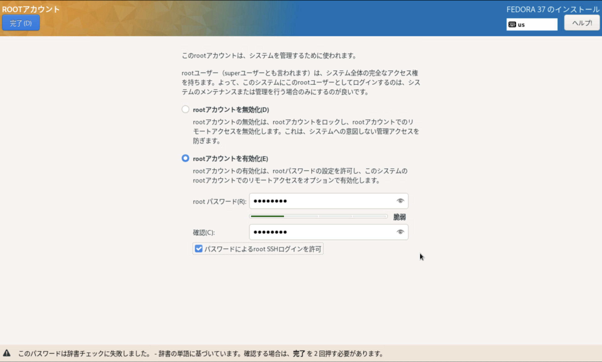

# Fedora37 + Kubernetes + Proxy

Proxy経由でインターネット疎通できる Fedora37 の上に kubeadm で Kubernetes を構築する。 \
Proxyサーバは `192.168.13.2:8080` である前提で手順を記載するため、適宜読み替えて実施すること。

## Fedora 構築

- 以下の構成で Fedora を 6 台構築する。（ControlPlane: 3台, WorkerNode: 2台, 管理クライアント: 1台）
  - 仮想マシンスペック
    - CPU: 2 core
    - Mem: 4 GB
    - Disk: 80 GB
  - インストールメディア
    - Fedora-Server-dvd-x86_64-37-1.7.iso

- インストール時に以下を有効化する
  - root アカウントを有効化
  - パスワードによるroot SSHログインを許可
  - 
  - 

- コンソールから root ユーザでログインし ホスト名 / IP アドレス / Gateway / DNS を変更する。本手順では以下を前提としてコマンドを記載するため、環境に応じて適宜読み替えて実施すること。

  | \# | ホスト名 | IPアドレス |
  | :---: | :---: | :---: |
  | ControlPlane#1 | k8s-cp01 | 192.168.14.11 |
  | ControlPlane#2 | k8s-cp02 | 192.168.14.12 |
  | ControlPlane#3 | k8s-cp03 | 192.168.14.13 |
  | WorkerNode#1 | k8s-worker01 | 192.168.14.21 |
  | WorkerNode#2 | k8s-worker02 | 192.168.14.22 |
  | 管理クライアント | k8s-management | 192.168.14.30 |

  ```bash
  # コマンド例
  hostnamectl set-hostname k8s-cp01
  ip a
  nmcli connection modify ens192 ipv4.addresses 192.168.14.11/24
  nmcli connection modify ens192 ipv4.gateway 192.168.14.1
  nmcli connection modify ens192 ipv4.dns 192.168.13.2
  nmcli connection modify ens192 ipv4.method manual
  nmcli connection down ens192
  nmcli connection up ens192
  ip a
  ```

## Fedora の Proxy 設定

実施対象サーバ：6台全て

```bash
vim /etc/environment
```

以下を末尾に追記

```text
export http_proxy=http://192.168.13.2:8080/
export HTTP_PROXY=http://192.168.13.2:8080/

export https_proxy=http://192.168.13.2:8080/
export HTTPS_PROXY=http://192.168.13.2:8080/

export no_proxy=localhost,127.0.0.1,192.168.14.10,192.168.14.11,192.168.14.12,192.168.14.13,192.168.14.21,192.168.14.22,192.168.14.0/24,10.96.0.0/12,10.20.0.0/16,vip-k8s-master,*.svc
export NO_PROXY=localhost,127.0.0.1,192.168.14.10,192.168.14.11,192.168.14.12,192.168.14.13,192.168.14.21,192.168.14.22,192.168.14.0/24,10.96.0.0/12,10.20.0.0/16,vip-k8s-master,*.svc
```

<!--
FIXME
- 192.168.13.2:8080
  - Proxy サーバのIP・ポート番号を指定
- 192.168.13.0/24
  - 構築しているサーバが接続されているローカルネットワークのネットワークアドレス
- 192.168.13.19
  - Kubernetes の API サーバとして指定する VIP
- 192.168.14.11 〜 192.168.14.22
  - ControlPlane#1-3, WorkerNode#1-2 の IP
- vip-k8s-master.home.ndeguchi.com
  - Kubernetes の API サーバとして指定するドメイン名
-->

```bash
source /etc/environment
```

## (OPTIONAL) tmux,vim,bash,dnf-cache

```bash
# tmux インストール
dnf install -y tmux
curl -O https://raw.githubusercontent.com/nkdgc/server-setup/main/tmux/.tmux.conf

# .vimrc 取得
curl -O https://raw.githubusercontent.com/nkdgc/server-setup/main/vim/.vimrc

# .bashrc 追記
cat <<EOF >> ~/.bashrc
alias k=kubectl
set -o vi
EOF

# dnfリポジトリキャッシュ更新無効化
systemctl disable dnf-makecache.timer
```

## Firewall Stop

実施対象サーバ：管理クライアント以外の5台全て

```bash
systemctl stop firewalld
systemctl disable firewalld
systemctl status firewalld
# "Active: inactive (dead)" であることを確認する
```

## Swap Off

実施対象サーバ：管理クライアント以外の5台全て

```bash
dnf remove -y zram-generator-defaults
swapoff -a
swapon --show
# 何も出力されないことを確認する
```

## Forwarding/Bridge 許可

実施対象サーバ：管理クライアント以外の5台全て

```bash
cat <<EOF | sudo tee /etc/modules-load.d/k8s.conf
overlay
br_netfilter
EOF

modprobe overlay 

modprobe br_netfilter

cat <<EOF | tee /etc/sysctl.d/k8s.conf
net.bridge.bridge-nf-call-iptables = 1
net.bridge.bridge-nf-call-ip6tables = 1
net.ipv4.ip_forward = 1
EOF
```

## Selinux を無効化

実施対象サーバ：管理クライアント以外の5台全て

```
cat /etc/selinux/config
sed -i 's/^SELINUX=enforcing$/SELINUX=permissive/' /etc/selinux/config
cat /etc/selinux/config
```

## 再起動

実施対象サーバ：管理クライアント以外の5台全て

```bash
shutdown -r now
```

## 確認

実施対象サーバ：管理クライアント以外の5台全て

```bash
env | grep -i proxy | sort
```

```text
<出力例: 上記で設定した Proxy の設定が反映されていることを確認>
HTTPS_PROXY=http://192.168.13.2:8080/
HTTP_PROXY=http://192.168.13.2:8080/
NO_PROXY=localhost,127.0.0.1,192.168.14.10,192.168.14.11,192.168.14.12,192.168.14.13,192.168.14.21,192.168.14.22,192.168.14.0/24,10.96.0.0/12,10.20.0.0/16,vip-k8s-master,*.svc
http_proxy=http://192.168.13.2:8080/
https_proxy=http://192.168.13.2:8080/
no_proxy=localhost,127.0.0.1,192.168.14.10,192.168.14.11,192.168.14.12,192.168.14.13,192.168.14.21,192.168.14.22,192.168.14.0/24,10.96.0.0/12,10.20.0.0/16,vip-k8s-master,*.svc
```

```bash
sysctl net.bridge.bridge-nf-call-iptables net.bridge.bridge-nf-call-ip6tables net.ipv4.ip_forward
```

```text
<出力例: すべて 1 が指定されていることを確認>
net.bridge.bridge-nf-call-iptables = 1
net.bridge.bridge-nf-call-ip6tables = 1
net.ipv4.ip_forward = 1
```

```bash
getenforce
```

```text
<出力例：以下が出力されることを確認する>
Permissive
```


## Docker Engine Install

実施対象サーバ：6台全て

```bash
# 古いバージョンのDocker パッケージを削除
dnf remove -y docker docker-client docker-client-latest docker-common docker-latest docker-latest-logrotate docker-logrotate docker-selinux docker-engine-selinux docker-engine

# リポジトリを追加
dnf -y install dnf-plugins-core
dnf config-manager --add-repo https://download.docker.com/linux/fedora/docker-ce.repo

# Docker Engine をインストール
dnf install -y docker-ce docker-ce-cli containerd.io docker-buildx-plugin docker-compose-plugin

# Docker Engine を起動
systemctl start docker
systemctl enable docker
systemctl status docker 
docker run --rm hello-world
```

docker で proxy の設定をまだ行っていないため、失敗することを確認する。

```
<出力例：以下エラーが出力されることを確認>
Unable to find image 'hello-world:latest' locally
docker: Error response from daemon: Get "https://registry-1.docker.io/v2/": dial tcp 3.216.34.172:443: connect: network is unreachable.
See 'docker run --help'.
```

## Docker の Proxy 設定

実施対象サーバ：6台全て

```bash
# 設定ファイル作成
mkdir -p /etc/systemd/system/docker.service.d
vim /etc/systemd/system/docker.service.d/http-proxy.conf
```

```
[Service]
Environment="HTTP_PROXY=http://192.168.13.2:8080"
Environment="HTTPS_PROXY=http://192.168.13.2:8080"
Environment="NO_PROXY=localhost,127.0.0.1,192.168.14.10,192.168.14.11,192.168.14.12,192.168.14.13,192.168.14.21,192.168.14.22,192.168.14.0/24,10.96.0.0/12,10.20.0.0/16,vip-k8s-master,*.svc"
```

<!--
FIXME
- 192.168.13.2:8080
  - Proxy サーバのIP・ポート番号を指定
- 192.168.13.19
  - Kubernetes の API サーバとして指定する VIP
- 192.168.14.11 〜 192.168.14.22
  - ControlPlane#1-3, WorkerNode#1-2 の IP
- vip-k8s-master.home.ndeguchi.com
  - Kubernetes の API サーバとして指定するドメイン名を指定
-->

```bash
# 反映
systemctl daemon-reload
systemctl restart docker
systemctl status docker

# 設定値確認
systemctl show --property=Environment docker
```

```text
<出力例>
Environment=HTTP_PROXY=http://192.168.13.2:8080 HTTPS_PROXY=http://192.168.13.2:8080 "NO_PROXY=localhost,127.0.0.1,192.168.14.10,192.168.14.11,192.168.14.12,192.168.14.13,192.168.14.21,192.168.14.22,192.168.14.0/24,10.96.0.0/12,10.20.0.0/16,vip-k8s-master,*.svc"
```

```bash
# 動作確認
docker run --rm hello-world
```

docker で proxy の設定を行ったことによりインターネットからコンテナイメージを取得出来るようになり正常に実行できることを確認する。

```text
<出力例: 以下のように hello-world コンテナの実行結果が出力されることを確認する>
Unable to find image 'hello-world:latest' locally
latest: Pulling from library/hello-world
719385e32844: Pull complete
Digest: sha256:88ec0acaa3ec199d3b7eaf73588f4518c25f9d34f58ce9a0df68429c5af48e8d
Status: Downloaded newer image for hello-world:latest

Hello from Docker!
This message shows that your installation appears to be working correctly.

To generate this message, Docker took the following steps:
 1. The Docker client contacted the Docker daemon.
 2. The Docker daemon pulled the "hello-world" image from the Docker Hub.
    (amd64)
 3. The Docker daemon created a new container from that image which runs the
    executable that produces the output you are currently reading.
 4. The Docker daemon streamed that output to the Docker client, which sent it
    to your terminal.

To try something more ambitious, you can run an Ubuntu container with:
 $ docker run -it ubuntu bash

Share images, automate workflows, and more with a free Docker ID:
 https://hub.docker.com/

For more examples and ideas, visit:
 https://docs.docker.com/get-started/
```


## cri-dockerd のインストール

実施対象サーバ：管理クライアント以外の5台全て

```bash
# 前提パッケージインストール
dnf install -y git make go

# git コマンドの proxy 設定(環境に合わせてproxyサーバのIP/PortNoを変更すること)
git config --global http.proxy http://192.168.13.2:8080

# cri-dockerd をダウンロード
cd ; git clone https://github.com/Mirantis/cri-dockerd.git

# cri-dockerd をビルド
cd cri-dockerd
make cri-dockerd

# cri-dockerd をインストール
mkdir -p /usr/local/bin
install -o root -g root -m 0755 cri-dockerd /usr/local/bin/cri-dockerd
install packaging/systemd/* /etc/systemd/system
sed -i -e 's,/usr/bin/cri-dockerd,/usr/local/bin/cri-dockerd,' /etc/systemd/system/cri-docker.service
systemctl daemon-reload
systemctl enable cri-docker.service 
systemctl start  cri-docker.socket
systemctl status cri-docker.socket
```


## kubeadm, kubectl, kubelet のインストール

実施対象サーバ：管理クライアント以外の5台全て

```bash
# リポジトリ追加
cat <<EOF | sudo tee /etc/yum.repos.d/kubernetes.repo
[kubernetes]
name=Kubernetes
baseurl=https://pkgs.k8s.io/core:/stable:/v1.28/rpm/
enabled=1
gpgcheck=1
gpgkey=https://pkgs.k8s.io/core:/stable:/v1.28/rpm/repodata/repomd.xml.key
EOF

cat /etc/yum.repos.d/kubernetes.repo

# Kubeadm、kubectl、kubeletをインストール
dnf install -y kubelet kubeadm kubectl

systemctl daemon-reload
systemctl start kubelet
systemctl enable kubelet
systemctl status kubelet
# 起動に失敗し code=exited, status=1/FAILURE のエラーが出力されているが現時点では問題無し。
```

# /ets/hosts 登録

実施対象サーバ：6台全て

```bash
cat <<EOF >> /etc/hosts
192.168.14.10 vip-k8s-master
EOF

cat /etc/hosts
```

## HAProxy(LB) のインストール

実施対象サーバ：ControlPlane#1-3 の 3 台のみで実施 **(注意)**

```bash
dnf install -y haproxy keepalived
```

## HAProxy(LB) の設定・起動 - ControlPlane#1

実施対象サーバ：ControlPlane#1 のみで実施 **(注意)**

```bash
vim /etc/keepalived/check_apiserver.sh
```

```bash
#!/bin/sh
APISERVER_VIP=192.168.14.10
APISERVER_DEST_PORT=6443
errorExit() {
  echo "*** $*" 1>&2
  exit 1
}
curl --silent --max-time 2 --insecure https://localhost:${APISERVER_DEST_PORT}/ -o /dev/null || errorExit "Error GET https://localhost:${APISERVER_DEST_PORT}/"
if ip addr | grep -q ${APISERVER_VIP}; then
  curl --silent --max-time 2 --insecure https://${APISERVER_VIP}:${APISERVER_DEST_PORT}/ -o /dev/null || errorExit "Error GET https://${APISERVER_VIP}:${APISERVER_DEST_PORT}/"
fi
```

- 192.168.14.10
  - API サーバの VIP を指定

```bash
# 作成したcheck_apiserver.shファイルに実行する権限を付与する
chmod +x /etc/keepalived/check_apiserver.sh

# keepalived を設定
cp /etc/keepalived/keepalived.conf /etc/keepalived/keepalived.conf-org
sh -c '> /etc/keepalived/keepalived.conf'
vim /etc/keepalived/keepalived.conf
```

```text
! /etc/keepalived/keepalived.conf
! Configuration File for keepalived
global_defs {
  router_id LVS_DEVEL
}
vrrp_script check_apiserver {
  script "/etc/keepalived/check_apiserver.sh"
  interval 3
  weight -2
  fall 10
  rise 2
}

vrrp_instance VI_1 {
  state MASTER
  interface ens192
  virtual_router_id 151
  priority 255
  authentication {
    auth_type PASS
    auth_pass P@##D321!
  }
  virtual_ipaddress {
    192.168.14.10/24
  }
  track_script {
    check_apiserver
  }
}
```

- 192.168.14.10/24
  - API サーバの VIP/Mask を指定

```bash
# haproxy を修正する
cp /etc/haproxy/haproxy.cfg /etc/haproxy/haproxy.cfg-org
vim /etc/haproxy/haproxy.cfg
```

defaults セクションの1つしたのセクション以降を全て削除し、以下の内容を追記する

```text
#---------------------------------------------------------------------
# apiserver frontend which proxys to the masters
#---------------------------------------------------------------------
frontend apiserver
    bind *:8443
    mode tcp
    option tcplog
    default_backend apiserver

#---------------------------------------------------------------------
# round robin balancing for apiserver
#---------------------------------------------------------------------
backend apiserver
    option httpchk GET /healthz
    http-check expect status 200
    mode tcp
    option ssl-hello-chk
    balance roundrobin
        server k8s-cp01 192.168.14.11:6443 check
        server k8s-cp02 192.168.14.12:6443 check
        server k8s-cp03 192.168.14.13:6443 check
```

- 192.168.14.11 〜 192.168.14.13
  - ControlPlane#1-3 の IP アドレスを指定


```bash
# haproxy.cfg の妥当性確認
haproxy -c -f /etc/haproxy/haproxy.cfg
# -> "Configuration file is valid" が出力されること。
#    WARNING が出力されるが問題なし。

# keepalivedとhaproxyを起動
systemctl start keepalived
systemctl enable keepalived
systemctl status keepalived

systemctl start haproxy
systemctl enable haproxy
systemctl status haproxy

# NICにVIPが設定されることを確認する
ip a
```

```test
<出力例>
2: ens192: <BROADCAST,MULTICAST,UP,LOWER_UP> mtu 1500 qdisc mq state UP group default qlen 1000
    link/ether 00:50:56:95:1b:e6 brd ff:ff:ff:ff:ff:ff
    altname enp11s0
    inet 192.168.14.11/24 brd 192.168.14.225 scope global noprefixroute ens192 ←ControlPlane#1 のIP★
       valid_lft forever preferred_lft forever
    inet 192.168.13.19/24 scope global secondary ens192 ←VIP★
       valid_lft forever preferred_lft forever
```


## HAProxy(LB) の設定 - ControlPlane#2

実施対象サーバ：ControlPlane#2 のみで実施 **(注意)**

```bash
# ControlPlane#1 から keepalived.conf を取得する
scp root@192.168.14.11:/etc/keepalived/keepalived.conf /etc/keepalived/keepalived.conf
cp /etc/keepalived/keepalived.conf /etc/keepalived/keepalived.conf.bak

# "state MASTER" を "state SLAVE" に変更する
sed -i -e "s/state MASTER/state SLAVE/" /etc/keepalived/keepalived.conf

# "priority 255" を "priority 254" に変更する
sed -i -e "s/priority 255/priority 254/" /etc/keepalived/keepalived.conf

diff /etc/keepalived/keepalived.conf.bak /etc/keepalived/keepalived.conf
```

差分が以下のみであることを確認する。

```text
<出力例>
15c15
<   state MASTER
---
>   state SLAVE
18c18
<   priority 255
---
>   priority 254
```


## HAProxy(LB) の設定 - ControlPlane#3

実施対象サーバ：ControlPlane#3 のみで実施 **(注意)**

```bash
# ControlPlane#1 から keepalived.conf を取得する
scp root@192.168.14.11:/etc/keepalived/keepalived.conf /etc/keepalived/keepalived.conf
cp /etc/keepalived/keepalived.conf /etc/keepalived/keepalived.conf.bak

# "state MASTER" を "state SLAVE" に変更する
sed -i -e "s/state MASTER/state SLAVE/" /etc/keepalived/keepalived.conf

# "priority 255" を "priority 253" に変更する
sed -i -e "s/priority 255/priority 253/" /etc/keepalived/keepalived.conf

diff /etc/keepalived/keepalived.conf.bak /etc/keepalived/keepalived.conf
```

差分が以下のみであることを確認する。

```text
<出力例>
15c15
<   state MASTER
---
>   state SLAVE
18c18
<   priority 255
---
>   priority 253
```

## HAProxy(LB) の設定・起動 - ControlPlane#2,3

実施対象サーバ：ControlPlane#2,3 の2台のみで実施 **(注意)**

```bash
# ControlPlane#1 から check_apiserver.sh を取得し実行権限を付与する
scp root@192.168.14.11:/etc/keepalived/check_apiserver.sh /etc/keepalived/check_apiserver.sh
chmod +x /etc/keepalived/check_apiserver.sh
ll  /etc/keepalived/check_apiserver.sh
cat /etc/keepalived/check_apiserver.sh

# ControlPlane#1 から haproxy.cfg を取得する
cp /etc/haproxy/haproxy.cfg /etc/haproxy/haproxy.cfg-org
scp root@192.168.14.11:/etc/haproxy/haproxy.cfg /etc/haproxy/haproxy.cfg
ll  /etc/haproxy/haproxy.cfg
cat /etc/haproxy/haproxy.cfg

# keepalivedとhaproxyを起動
systemctl start keepalived
systemctl enable keepalived
systemctl status keepalived

systemctl start haproxy
systemctl enable haproxy
systemctl status haproxy
```


## Kubernetes クラスタの起動

実施対象サーバ：ControlPlane#1 のみで実施 **(注意)**


```bash
kubeadm init --control-plane-endpoint "vip-k8s-master:8443" --upload-certs --pod-network-cidr 10.20.0.0/16 --cri-socket=unix:///var/run/cri-dockerd.sock --v 9
```

<!--
FIXME
- vip-k8s-master.home.ndeguchi.com
  - API サーバのドメイン名を指定
-->

```text
<出力例: 上記コマンドの実行に成功すると、標準出力の末尾に以下と同様の情報が出力される>
Your Kubernetes control-plane has initialized successfully!

To start using your cluster, you need to run the following as a regular user:

  mkdir -p $HOME/.kube
  sudo cp -i /etc/kubernetes/admin.conf $HOME/.kube/config
  sudo chown $(id -u):$(id -g) $HOME/.kube/config

Alternatively, if you are the root user, you can run:

  export KUBECONFIG=/etc/kubernetes/admin.conf

You should now deploy a pod network to the cluster.
Run "kubectl apply -f [podnetwork].yaml" with one of the options listed at:
  https://kubernetes.io/docs/concepts/cluster-administration/addons/

You can now join any number of the control-plane node running the following command on each as root:

  kubeadm join vip-k8s-master:8443 --token lfzmy3.o6yiq7wyiv838qg7 \
        --discovery-token-ca-cert-hash sha256:e1b16fb333f1cb2e10e2ff9d70e8d6921c1ca997512bdf29775319c3e3b0c47c \
        --control-plane --certificate-key c2a0bedb5862967d22bd2ee16bb155e0f62851d918dcb23a465dadc9244c529f

Please note that the certificate-key gives access to cluster sensitive data, keep it secret!
As a safeguard, uploaded-certs will be deleted in two hours; If necessary, you can use
"kubeadm init phase upload-certs --upload-certs" to reload certs afterward.

Then you can join any number of worker nodes by running the following on each as root:

kubeadm join vip-k8s-master:8443 --token lfzmy3.o6yiq7wyiv838qg7 \
        --discovery-token-ca-cert-hash sha256:e1b16fb333f1cb2e10e2ff9d70e8d6921c1ca997512bdf29775319c3e3b0c47c
```

上記で出力された以下コマンドは後の作業で使用するため控えておく。


## ControlPlane 追加

実施対象サーバ：ControlPlane#2,3 の2台のみで実施 **(注意)**

上記、「Kubernetes クラスタの起動」で出力された control-plane node を追加するコマンドにオプション `--cri-socket=unix:///var/run/cri-dockerd.sock --v 9` を追加して実行する。

```bash
# コマンド例
kubeadm join vip-k8s-master.home.ndeguchi.com:8443 --token 3p4xvv.573ssbuf5cj9a7ix \
--discovery-token-ca-cert-hash sha256:4893db001a479cfe8913afa2fab4ecc7a6278ceebdf160910a1b291c2625b206 \
--control-plane --certificate-key 4ef92e160ed8d207f43397611c54ad612c752efb6b699c1fc7d250c2ecfe912f \
--cri-socket=unix:///var/run/cri-dockerd.sock --v 9
```

```text
<出力例>
This node has joined the cluster and a new control plane instance was created:

* Certificate signing request was sent to apiserver and approval was received.
* The Kubelet was informed of the new secure connection details.
* Control plane label and taint were applied to the new node.
* The Kubernetes control plane instances scaled up.
* A new etcd member was added to the local/stacked etcd cluster.

To start administering your cluster from this node, you need to run the following as a regular user:

	mkdir -p $HOME/.kube
	sudo cp -i /etc/kubernetes/admin.conf $HOME/.kube/config
	sudo chown $(id -u):$(id -g) $HOME/.kube/config

Run 'kubectl get nodes' to see this node join the cluster.
```

## WorkerNode 追加

実施対象サーバ：WorkerNode#1,2 の2台のみで実施 **(注意)**

上記、「Kubernetes クラスタの起動」で出力された worker node を追加するコマンドにオプション `--cri-socket=unix:///var/run/cri-dockerd.sock --v 9` を追加して実行する。

```bash
kubeadm join vip-k8s-master.home.ndeguchi.com:8443 --token 3p4xvv.573ssbuf5cj9a7ix \
  --discovery-token-ca-cert-hash sha256:4893db001a479cfe8913afa2fab4ecc7a6278ceebdf160910a1b291c2625b206 \
  --cri-socket=unix:///var/run/cri-dockerd.sock --v 9
```

```text
<出力例>
This node has joined the cluster:
* Certificate signing request was sent to apiserver and a response was received.
* The Kubelet was informed of the new secure connection details.

Run 'kubectl get nodes' on the control-plane to see this node join the cluster.
```

## kubectl で接続 - ControlPlane

実施対象サーバ：ControlPlane#1,2,3 の3台のみで実施 **(注意)**

```bash
mkdir -p $HOME/.kube
cp -i /etc/kubernetes/admin.conf $HOME/.kube/config
kubectl get node
```

```text
<出力例：NotReadyだが現時点では問題なし>
NAME           STATUS     ROLES           AGE     VERSION
k8s-cp01       NotReady   control-plane   3m49s   v1.28.3
k8s-cp02       NotReady   control-plane   2m17s   v1.28.3
k8s-cp03       NotReady   <none>          87s     v1.28.3
k8s-worker01   NotReady   <none>          66s     v1.28.3
k8s-worker02   NotReady   <none>          46s     v1.28.3
```

## 管理クライアントにGUIインストール

実施対象サーバ：管理クライアント **(注意)**

```bash
adduser portal
passwd portal
dnf update
dnf group list
dnf install -y @cinnamon-desktop-environment
systemctl set-default graphical.target
reboot
```

再起動後、コンソールに接続し GUI で起動できていることを確認する。 \
また、上記コマンドで作成した ユーザ・パスワード でGUIにログインできることを確認する。

- 
- 


## kubectl で接続 - 管理クライアント

実施対象サーバ：管理クライアント **(注意)**

```bash
# リポジトリ追加
cat <<EOF | sudo tee /etc/yum.repos.d/kubernetes.repo
[kubernetes]
name=Kubernetes
baseurl=https://pkgs.k8s.io/core:/stable:/v1.28/rpm/
enabled=1
gpgcheck=1
gpgkey=https://pkgs.k8s.io/core:/stable:/v1.28/rpm/repodata/repomd.xml.key
EOF

cat /etc/yum.repos.d/kubernetes.repo

# kubectl をインストール
dnf install -y kubectl

mkdir -p $HOME/.kube
scp root@192.168.14.11:/root/.kube/config /root/.kube/config
kubectl get node
```

```text
<出力例：NotReadyだが現時点では問題なし>
NAME           STATUS     ROLES           AGE     VERSION
k8s-cp01       NotReady   control-plane   3m49s   v1.28.3
k8s-cp02       NotReady   control-plane   2m17s   v1.28.3
k8s-cp03       NotReady   <none>          87s     v1.28.3
k8s-worker01   NotReady   <none>          66s     v1.28.3
k8s-worker02   NotReady   <none>          46s     v1.28.3
```

## CNI (Calico) インストール

実施対象サーバ：管理クライアント **(注意)**

```bash
kubectl create -f https://raw.githubusercontent.com/projectcalico/calico/v3.26.3/manifests/tigera-operator.yaml
curl -O https://raw.githubusercontent.com/projectcalico/calico/v3.26.3/manifests/custom-resources.yaml
cp -p custom-resources.yaml custom-resources.yaml.bak

# 下記 diff 結果の通り変更する
vim custom-resources.yaml

diff -u custom-resources.yaml.bak custom-resources.yaml
```

```text
<出力例：diff結果>
--- custom-resources.yaml.bak   2023-11-12 14:43:06.419699932 +0900
+++ custom-resources.yaml       2023-11-12 14:43:52.123696933 +0900
@@ -10,7 +10,7 @@
     # Note: The ipPools section cannot be modified post-install.
     ipPools:
     - blockSize: 26
-      cidr: 192.168.0.0/16
+      cidr: 10.20.0.0/16
       encapsulation: VXLANCrossSubnet
       natOutgoing: Enabled
       nodeSelector: all()
```

```bash
kubectl create -f custom-resources.yaml
watch kubectl get pods -n calico-system
```

```text
<出力例：全てのPodが "1/1 Running" または "2/2 Running" になるまで待機する>
NAME                                       READY   STATUS    RESTARTS   AGE
calico-kube-controllers-697c9f4d8d-wsq6m   1/1     Running   0          3m1s
calico-node-748gb                          1/1     Running   0          3m2s
calico-node-8wpjf                          1/1     Running   0          3m2s
calico-node-cwkgh                          1/1     Running   0          3m2s
calico-node-q82l8                          1/1     Running   0          3m2s
calico-node-zt6pt                          1/1     Running   0          3m2s
calico-typha-768ff5d5fd-72jdv              1/1     Running   0          2m56s
calico-typha-768ff5d5fd-b4tz4              1/1     Running   0          3m2s
calico-typha-768ff5d5fd-vz225              1/1     Running   0          2m56s
csi-node-driver-flkp4                      2/2     Running   0          3m1s
csi-node-driver-jrdtd                      2/2     Running   0          3m1s
csi-node-driver-nkpdr                      2/2     Running   0          3m1s
csi-node-driver-sh7jm                      2/2     Running   0          3m1s
csi-node-driver-tlpn5                      2/2     Running   0          3m1s
```


## Kubernetes 正常性確認

実施対象サーバ：管理クライアント **(注意)**

Kubernetes クラスタが正常に動作していることを確認する。

```bash
kubectl get node
```

```text
<出力例：node の Status が READY であることを確認する>
NAME           STATUS   ROLES           AGE     VERSION
k8s-cp01       Ready    control-plane   76m     v1.28.3
k8s-cp02       Ready    control-plane   60m     v1.28.3
k8s-cp03       Ready    control-plane   45m     v1.28.3
k8s-worker01   Ready    <none>          9m28s   v1.28.3
k8s-worker02   Ready    <none>          8m37s   v1.28.3
```

```bash
kubectl get pod -A
```

```text
<出力例：pod の Status が Running であることを確認する>
NAMESPACE         NAME                                       READY   STATUS    RESTARTS        AGE
kube-system       calico-kube-controllers-7ddc4f45bc-xh6p6   1/1     Running   0               10m
kube-system       calico-node-2bdtx                          1/1     Running   0               10m
kube-system       calico-node-2k7tr                          1/1     Running   0               10m
kube-system       calico-node-8lgmw                          1/1     Running   0               10m
kube-system       calico-node-ftmt6                          1/1     Running   0               10m
kube-system       calico-node-wpmzq                          1/1     Running   0               10m
kube-system       coredns-5dd5756b68-8n2ml                   1/1     Running   0               79m
kube-system       coredns-5dd5756b68-fhrmk                   1/1     Running   0               79m
kube-system       etcd-k8s-cp01                              1/1     Running   0               80m
kube-system       etcd-k8s-cp02                              1/1     Running   0               64m
kube-system       etcd-k8s-cp03                              1/1     Running   0               49m
kube-system       kube-apiserver-k8s-cp01                    1/1     Running   0               80m
kube-system       kube-apiserver-k8s-cp02                    1/1     Running   0               64m
kube-system       kube-apiserver-k8s-cp03                    1/1     Running   0               49m
kube-system       kube-controller-manager-k8s-cp01           1/1     Running   1 (64m ago)     80m
kube-system       kube-controller-manager-k8s-cp02           1/1     Running   1 (10m ago)     64m
kube-system       kube-controller-manager-k8s-cp03           1/1     Running   1 (8m48s ago)   49m
kube-system       kube-proxy-c4fm4                           1/1     Running   0               49m
kube-system       kube-proxy-f7747                           1/1     Running   0               13m
kube-system       kube-proxy-pdpbv                           1/1     Running   0               64m
kube-system       kube-proxy-vckfb                           1/1     Running   0               79m
kube-system       kube-proxy-z9k2q                           1/1     Running   0               12m
kube-system       kube-scheduler-k8s-cp01                    1/1     Running   2 (9m12s ago)   80m
kube-system       kube-scheduler-k8s-cp02                    1/1     Running   1 (10m ago)     64m
kube-system       kube-scheduler-k8s-cp03                    1/1     Running   0               49m
tigera-operator   tigera-operator-94d7f7696-99xml            1/1     Running   2 (9m20s ago)   10m
```


## MetalLB のインストール

実施対象サーバ：管理クライアント **(注意)**

```bash
kubectl get configmap kube-proxy -n kube-system -o yaml

# see what changes would be made, returns nonzero returncode if different
kubectl get configmap kube-proxy -n kube-system -o yaml | \
  sed -e "s/strictARP: false/strictARP: true/" | \
  kubectl diff -f - -n kube-system

# actually apply the changes, returns nonzero returncode on errors only
kubectl get configmap kube-proxy -n kube-system -o yaml | \
  sed -e "s/strictARP: false/strictARP: true/" | \
  kubectl apply -f - -n kube-system
# worning が出力されるが問題無し。"configmap/kube-proxy configured" が出力されること。

kubectl get configmap kube-proxy -n kube-system -o yaml

kubectl apply -f https://raw.githubusercontent.com/metallb/metallb/v0.13.12/config/manifests/metallb-native.yaml
watch kubectl get pod -n metallb-system
```

```
<出力例: 全ての Pod が 1/1 Running になるまで待機する。>
NAME                          READY   STATUS    RESTARTS   AGE
controller-786f9df989-kfz9k   1/1     Running   0          76s
speaker-54hlx                 1/1     Running   0          76s
speaker-rmkvs                 1/1     Running   0          76s
speaker-tlbq8                 1/1     Running   0          76s
speaker-tswjs                 1/1     Running   0          76s
speaker-vj84n                 1/1     Running   0          76s
```

```bash
# IP Pool を作成する
cd
vim ip-pool.yaml
```

```
apiVersion: metallb.io/v1beta1
kind: IPAddressPool
metadata:
  name: first-pool
  namespace: metallb-system
spec:
  addresses:
  - 192.168.14.200-192.168.14.224
---
apiVersion: metallb.io/v1beta1
kind: L2Advertisement
metadata:
  name: example
  namespace: metallb-system
spec:
  ipAddressPools:
  - first-pool
```

- 192.168.14.110-192.168.14.224
  - MetalLB (Load Balancer) で払い出すアドレスレンジを指定

```bash
kubectl apply -f ip-pool.yaml
```

```bash
k create deployment nginx-dep --image=nginx --replicas=2
k expose deployment/nginx-dep --type="LoadBalancer" --port 80
k get svc
```

